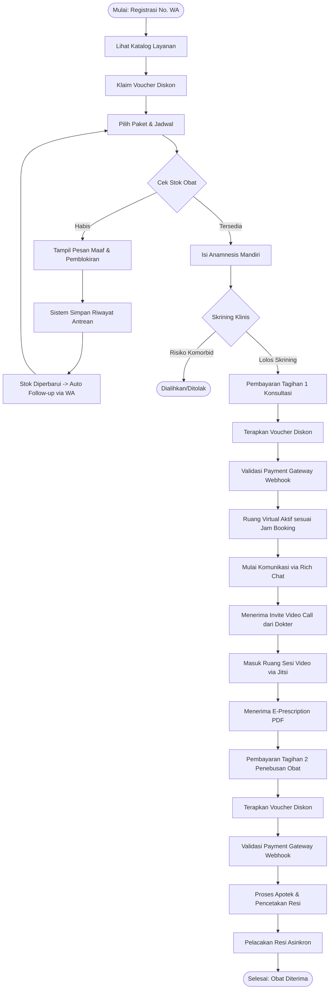
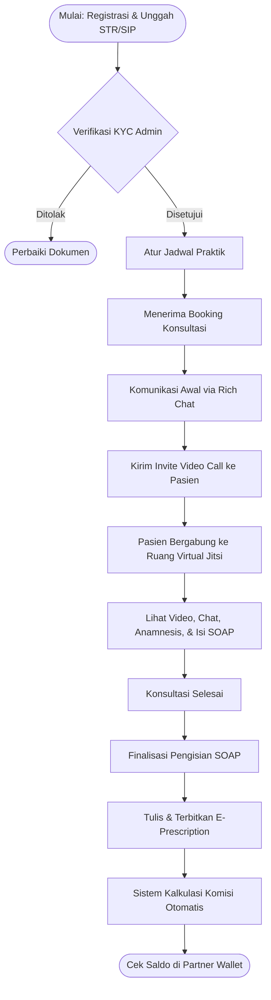
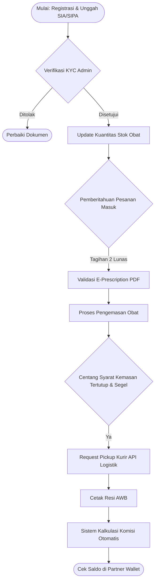
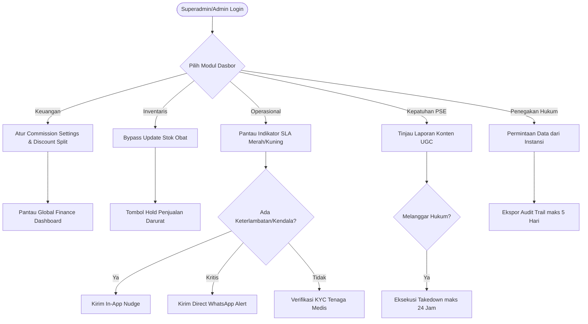
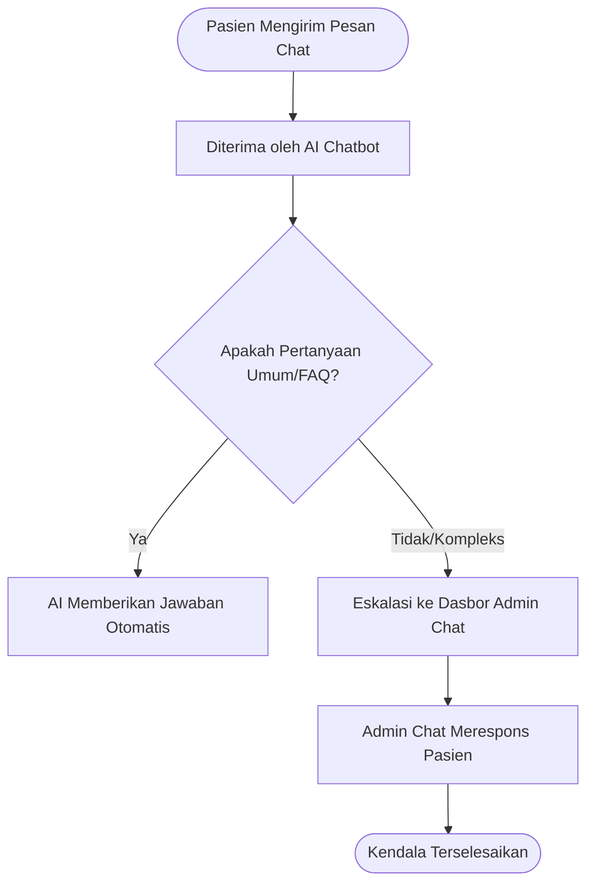
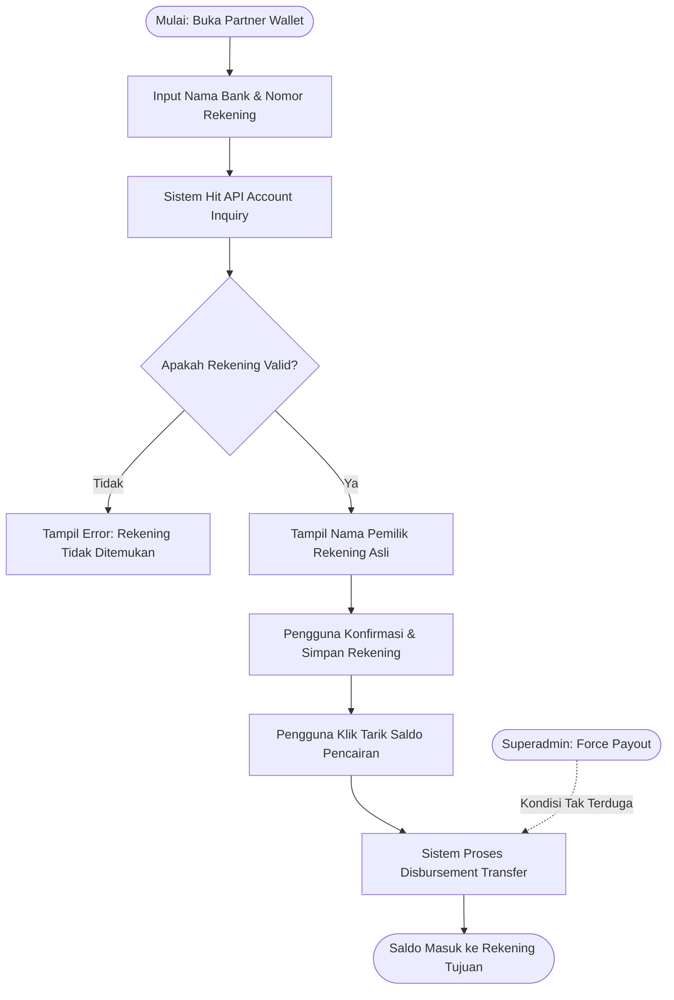

# 4. User Flow (Alur Pengguna)

Dokumen ini merinci alur interaksi pengguna dengan Sistem Telemedicine, baik dalam bentuk narasi teks maupun representasi visual menggunakan diagram alir (Flowchart).

---

## 4.1. Alur Pengguna: Pasien (End-to-End Journey)

**Deskripsi Teks:**
1. **Registrasi:** Pasien mendaftar menggunakan nomor WhatsApp aktif.
2. **Klaim Promosi:** Pasien mengklaim *voucher* diskon (melalui kode atau klik *banner*).
3. **Pemilihan Layanan & Cek Stok:** Pasien memilih paket layanan penurunan berat badan. Sistem akan mengecek ketersediaan stok obat:
   - Jika **Stok Habis**: Pasien diblokir dari pemesanan. Sistem menampilkan pesan maaf dan mencatat profil pasien. Ketika stok sudah diisi kembali oleh Apotek, sistem mengirim pesan *Auto Follow-up* via WhatsApp agar pasien melanjutkan pesanan.
   - Jika **Stok Tersedia**: Pasien diizinkan melanjutkan.
4. **Anamnesis Mandiri:** Pasien wajib mengisi kuesioner medis (*smart routing* akan menolak pasien jika terindikasi komorbid).
5. **Tagihan 1 (Jasa Medis):** Pasien masuk ke halaman pembayaran 1, memilih jadwal konsultasi, serta dapat menerapkan *voucher* (diskon Tagihan 1).
6. **Validasi & Menunggu Jadwal:** Sistem memvalidasi pembayaran via *Webhook*. Pasien menunggu jadwal *booking* tiba.
7. **Konsultasi (Multimedia Chat):** Saat jadwal tiba, Pasien dapat saling mengirim pesan *multimedia* (teks, suara, gambar, video) dengan Dokter via fitur *Rich Chat*. Apabila dibutuhkan, Dokter dapat mengirimkan *Video Call Invite*. Jika diundang, Pasien dapat menerima undangan tersebut dan masuk ke ruang Jitsi untuk melakukan panggilan video opsional dengan Dokter.
8. **E-Prescription & Tagihan 2:** Dokter menerbitkan resep. Pasien menerima tagihan kedua untuk penebusan obat dan dapat menerapkan *voucher* (diskon Tagihan 2).
9. **Fulfillment & Logistik:** Pembayaran 2 divalidasi. Apotek memproses resep. Pasien dapat melacak pengiriman melalui pembaruan resi asinkron hingga obat sampai.

**Diagram Alir (Pasien):**

---

## 4.2. Alur Pengguna: Dokter

**Deskripsi Teks:**
1. **Registrasi & Verifikasi KYC:** Dokter mendaftar akun dan wajib mengunggah dokumen legalitas (STR & SIP). Akun berstatus *pending* hingga disetujui Admin.
2. **Pengaturan Jadwal:** Setelah akun aktif, Dokter *login* dan mengatur ketersediaan slot jadwal praktik.
3. **Visibilitas Ketersediaan:** Dokter dapat melihat apakah status obat sedang "Tersedia" atau "Habis" di sistem.
4. **Persiapan Konsultasi:** Dokter menerima notifikasi jadwal konsultasi yang sudah terbayar oleh Pasien.
5. **Sesi Konsultasi (Rich Chat & Side-by-side):** Dokter berkomunikasi dengan Pasien via *Rich Chat* (mengirim/menerima teks, suara, gambar, video). Apabila diperlukan pemeriksaan visual, Dokter dapat menekan tombol *Invite Video Call*. Jika pasien bergabung ke video, layar Dokter akan menampilkan *streaming* video berdampingan dengan riwayat *chat*, form Anamnesis, dan formulir SOAP.
6. **Pengisian Rekam Medis (SOAP):** Saat sesi berlangsung atau setelah sesi ditutup, Dokter wajib mengisi catatan diagnosis klinis berformat SOAP. Sistem mengunci fitur peresepan sebelum formulir ini selesai.
7. **Penerbitan Resep:** Selesai merekam catatan medis, Dokter menerbitkan resep obat keras secara deskriptif (tanpa ICD, dan mematuhi validasi larangan peresepan narkotika/injeksi) yang otomatis diubah menjadi PDF *watermarked*.
8. **Bagi Hasil & Pencairan Dana:** Dokter memantau saldo pendapatan di Dasbor *Partner Wallet*. Dokter dapat mendaftarkan nomor rekening (divalidasi otomatis oleh sistem) lalu melakukan pencairan dana mandiri (*withdrawal*).
9. **Koordinasi:** Jika ada kendala, Dokter dapat menggunakan *Internal Chat* untuk berkoordinasi dengan Admin.

**Diagram Alir (Dokter):**

---

## 4.3. Alur Pengguna: Apotek

**Deskripsi Teks:**
1. **Registrasi & Verifikasi KYC:** Apotek mendaftar akun dan wajib mengunggah dokumen legalitas (SIA & SIPA). Akun berstatus *pending* hingga disetujui Admin.
2. **Pembaruan Stok:** Setelah akun aktif, Apotek *login* dan memasukkan jumlah (*input* kuantitas) stok obat yang tersedia.
3. **Penerimaan Pesanan:** Apotek menerima notifikasi pesanan setelah Tagihan 2 Pasien berstatus *Paid*.
4. **Validasi & Fulfillment:** Apotek melihat resep PDF, memvalidasi keabsahannya, lalu mulai menyiapkan obat.
5. **Keamanan & Logistik:** Apotek diwajibkan mencentang *checklist* kepatuhan (kemasan tertutup rapat, tidak tembus pandang, disegel khusus). Setelah dicentang, Apotek dapat mengatur *pickup* kurir (terintegrasi API Biteship untuk cetak resi otomatis).
6. **Bagi Hasil & Pencairan Dana:** Apotek memantau saldo pendapatan penjualan di *Partner Wallet*. Apotek mendaftarkan nomor rekening untuk divalidasi, lalu melakukan pencairan (*withdrawal*) langsung ke bank.
7. **Koordinasi:** Apotek dapat menghubungi Admin melalui *Internal Chat* jika ada kendala pasokan atau pengiriman.

**Diagram Alir (Apotek):**

---

## 4.4. Alur Pengguna: Superadmin & Admin Operasional

**Deskripsi Teks:**
1. **Konfigurasi Keuangan (Superadmin):** Superadmin mengatur *Commission Settings* (pembagian hasil) dan *Discount Split* (pembagian beban subsidi voucher) antara platform dan mitra.
2. **Manajemen Stok Darurat (Superadmin):** Jika Apotek berkendala, Superadmin dapat melakukan *bypass* untuk mengupdate stok, atau menekan tombol *Hold* untuk menyetop seluruh penjualan.
3. **Pemantauan SLA (Admin/Superadmin):** Mengawasi indikator warna (merah/kuning) pada tiket, jadwal konsultasi, atau waktu pengemasan.
4. **Eskalasi & Pengingat:** Jika terjadi keterlambatan tugas dari peran lain, Admin/Superadmin dapat menekan tombol *In-App Nudge* atau memicu *Direct WhatsApp Alert* kepada pengguna terkait.
5. **Verifikasi KYC (Admin):** Memvalidasi dokumen STR/SIP Dokter dan SIA/SIPA Apotek yang baru mendaftar agar akun mereka dapat aktif.
6. **Manajemen Chat:** Admin mengelola tiket obrolan internal (dari Dokter/Apotek) serta melihat eskalasi percakapan *Customer Support* dari Pasien (yang ditangani oleh Admin Chat).
7. **Kepatuhan PSE (Superadmin):** Superadmin bertindak sebagai Narahubung Hukum yang merespons Laporan Pengguna (*UGC*), mengeksekusi Pemutusan Akses (*Takedown*) maksimal 1x24 jam, serta menarik rekaman *Audit Trail* bagi keperluan Instansi Penegak Hukum (maksimal 5 hari).

**Diagram Alir (Superadmin & Admin):**

---

## 4.5. Alur Dukungan Pelanggan (Admin Chat & AI)

**Deskripsi Teks:**
1. **Pasien Mengirim Pesan:** Pasien membuka *widget chat* untuk bertanya.
2. **AI Chatbot (Auto-responder):** AI mendeteksi pertanyaan. Jika bersifat umum (FAQ), AI langsung merespons.
3. **Eskalasi ke Agen:** Jika pertanyaan spesifik atau AI gagal merespons, obrolan diteruskan secara otomatis kepada agen manusia (*Admin Chat*).
4. **Penanganan Keluhan:** *Admin Chat* merespons dan menyelesaikan kendala Pasien.

**Diagram Alir (Customer Support):**

---

## 4.6. Alur Registrasi Rekening & Pencairan Dana (Payout)

**Deskripsi Teks:**
1. **Registrasi Rekening:** Dokter atau Apotek mendaftarkan Bank dan Nomor Rekening melalui dasbor *Partner Wallet*.
2. **Validasi Account Inquiry:** Sistem secara *real-time* melakukan panggilan ke API Payment Gateway untuk memvalidasi keberadaan nomor rekening tersebut. Sistem kemudian memunculkan *Nama Pemilik Rekening* asli ke layar.
3. **Konfirmasi Pengguna:** Pengguna memastikan apakah nama yang muncul sudah sesuai (guna mencegah salah transfer), lalu menyimpannya.
4. **Pencairan Mandiri (Self-Service):** Dokter atau Apotek mengeklik tombol tarik saldo dari *Partner Wallet*.
5. **Eksekusi Transfer:** Sistem (via *Disbursement API*) memproses transfer dana bagi hasil langsung ke rekening bank pengguna.
6. **Pencairan Paksa (Force Payout):** Dalam situasi darurat atau kebutuhan tak terduga, Superadmin dapat mengakses Dasbor Keuangan dan memicu pencairan saldo bagi hasil secara paksa langsung ke rekening mitra yang sudah tervalidasi.

**Diagram Alir (Payout):**

