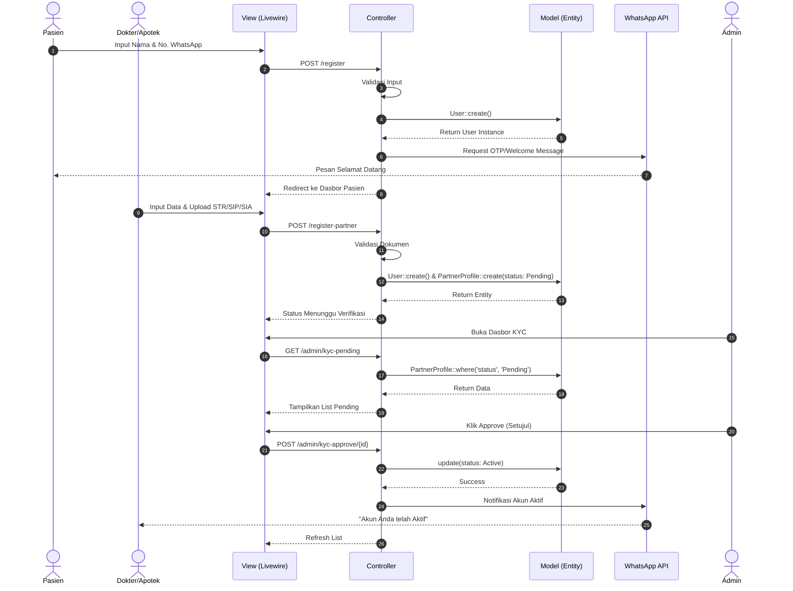
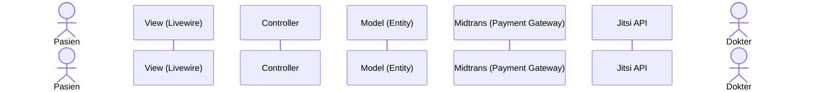
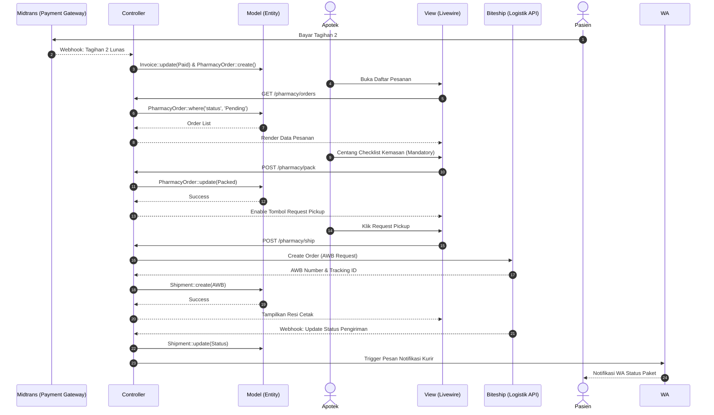
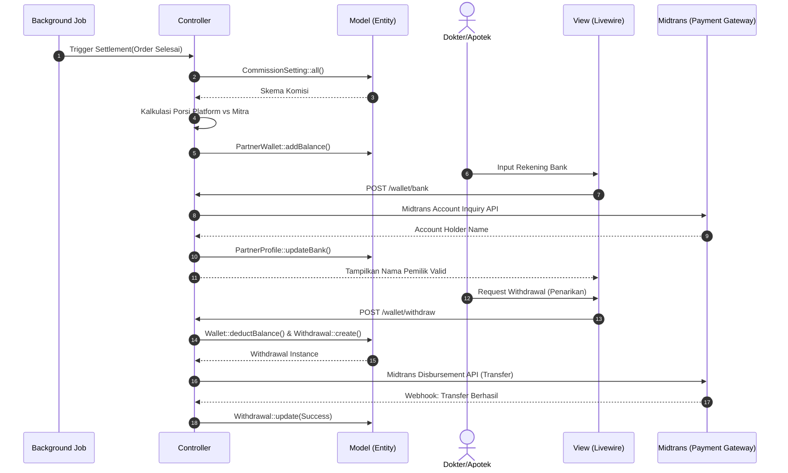

# 5. Architecture (Sequence Diagram)

Dokumen ini memuat *Sequence Diagram* untuk memvisualisasikan interaksi teknis antar komponen dalam sistem Telemedicine. Pendekatan arsitektur yang digunakan adalah **Modular Monolithic** berbasis standar desain **MVC (*Model-View-Controller*)** dengan kerangka kerja Laravel dan Livewire.

Partisipan standar yang digunakan pada diagram ini meliputi:
1. **View**: Merepresentasikan lapisan *Frontend* (Komponen *Blade* atau *Livewire*).
2. **Controller**: Merepresentasikan pengendali permintaan HTTP dan pusat logika (*Business Logic/Service*).
3. **Model**: Merepresentasikan *Entity* basis data (*Eloquent ORM*).
4. **Eksternal API**: Layanan pihak ketiga (*Payment Gateway*, *WhatsApp*, dll).

---

## 5.1. Pendaftaran & Verifikasi KYC
Diagram ini memvisualisasikan alur pendaftaran pengguna, mulai dari Pasien yang mendaftar via WhatsApp hingga Dokter/Apotek yang mengunggah dokumen legalitas (KYC) dan persetujuan Admin.

---

## 5.2. Alur Utama: Pemesanan, Transaksi Ganda (*Double Billing*), dan RME
Diagram *End-to-End* dari tahap Pasien memilih jadwal hingga terbitnya resep elektronik.

---

---

## 5.4. Kalkulasi Bagi Hasil & Pencairan Dana (Payout)
Diagram pengelolaan keuangan otomatis untuk distribusi komisi ke dompet mitra.

