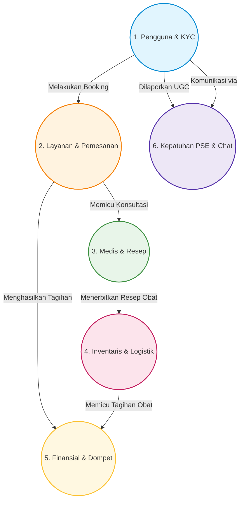
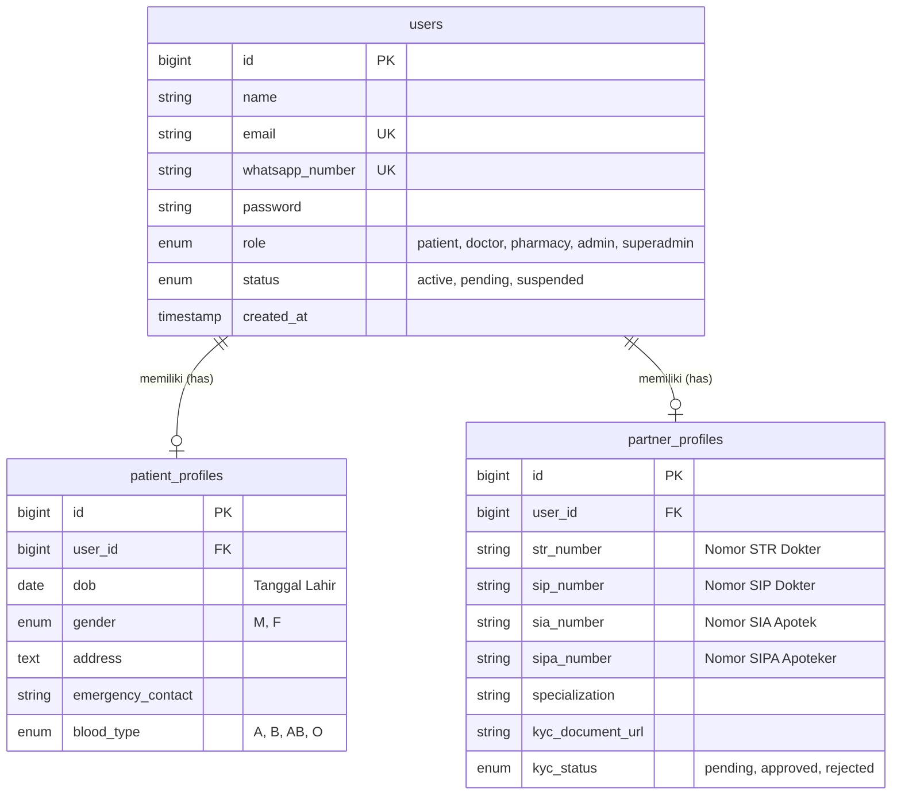
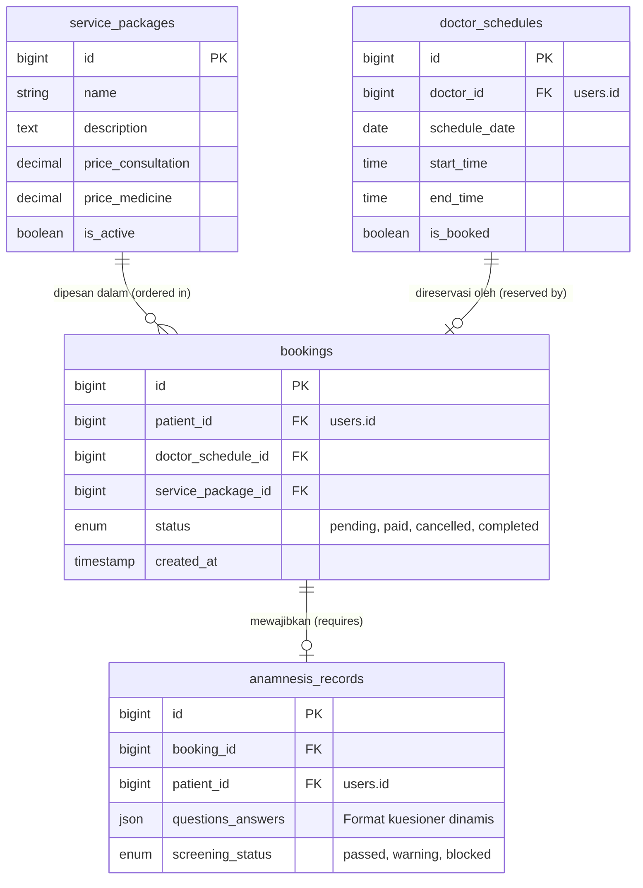
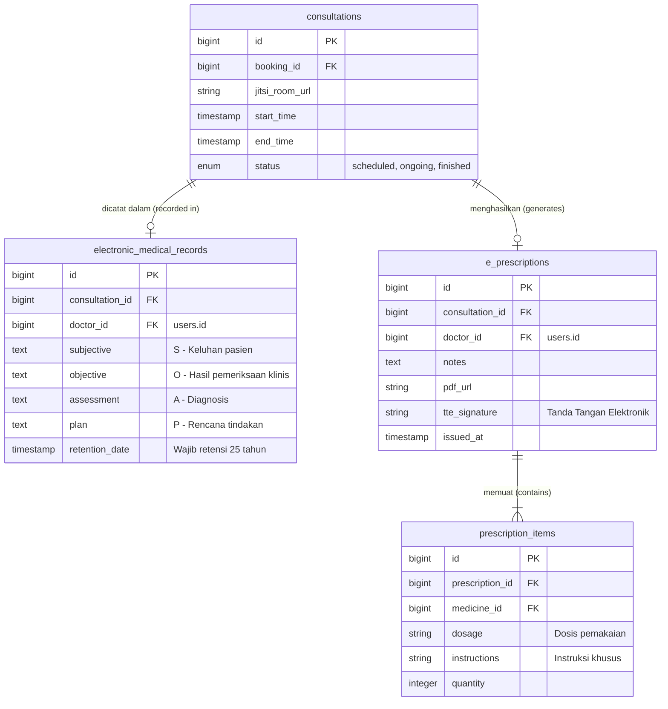
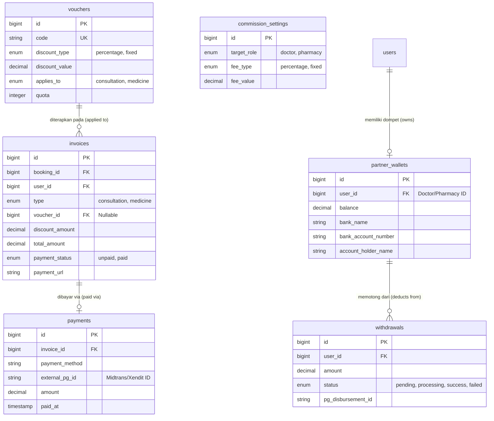
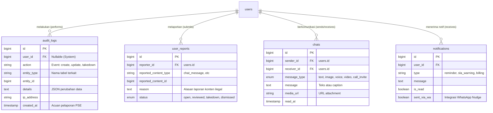

# 6. Database Schema (Entity Relationship Diagram)

Dokumen ini mendefinisikan struktur penyimpanan data (*database*) untuk sistem Telemedicine berbasis *Relational Database* (MySQL/PostgreSQL).
Karena sistem ini menaungi proses yang kompleks, struktur tabel dikelompokkan menjadi 6 sub-sistem/domain yang saling berinteraksi guna memudahkan pemahaman desain (*Maintainability*).

---

## 6.1. Diagram Korelasi Antar Sub-sistem (High-Level)
Diagram ini memberikan gambaran besar bagaimana ke-6 domain basis data terhubung dan berinteraksi dalam satu kesatuan sistem.

---

## 6.2. ERD Domain 1: Pengguna, Profil & Legalitas (KYC)
Sub-sistem ini mengelola autentikasi pengguna beserta detail profil medis. Termasuk pula penyimpanan dokumen legalitas (KYC) milik Dokter dan Apotek yang diperlukan untuk verifikasi operasional.

---

## 6.3. ERD Domain 2: Katalog, Jadwal & Skrining (Anamnesis)
Sub-sistem yang menyimpan master data layanan penurunan berat badan, ketersediaan jadwal dokter, proses reservasi (*booking*), serta kuesioner medis pasien (Anamnesis).

---

## 6.4. ERD Domain 3: Rekam Medis Elektronik (RME) & Resep Digital
Sub-sistem klinis yang menangani sesi ruang virtual, form RME/SOAP, serta pembuatan entitas Resep Elektronik (*E-Prescription*) ber-TTE.

---

## 6.5. ERD Domain 4: Inventaris & Logistik (Fulfillment)
Sub-sistem pengelolaan ketersediaan obat (Farmasi/Apotek) fisik, manajemen pengemasan (*checklist* regulasi obat keras), hingga pelacakan pengiriman kurir.

```mermaid
erDiagram
    medicines {
        bigint id PK
        bigint pharmacy_id FK "users.id"
        string name
        text description
        decimal price
        integer stock
        boolean is_hard_drug "Flag Obat Keras"
    }

    pharmacy_orders {
        bigint id PK
        bigint booking_id FK
        bigint prescription_id FK
        bigint pharmacy_id FK "users.id"
        boolean is_packaging_compliant "Checklist Segel Keras"
        enum status "pending, packing, ready, shipping, delivered"
    }

    shipments {
        bigint id PK
        bigint pharmacy_order_id FK
        string courier_name
        string awb_number "Nomor Resi Biteship"
        string tracking_url
        enum status "in_transit, delivered, returned"
    }

    medicines ||--o{ prescription_items : "direferensikan (referenced in)"
    e_prescriptions ||--o| pharmacy_orders : "diproses oleh (fulfilled by)"
    pharmacy_orders ||--o| shipments : "dikirim via (shipped via)"
```

---

## 6.6. ERD Domain 5: Finansial (Billing, Voucher, Payout)
Pusat perputaran uang. Mengelola tagihan berantai (*Double Billing*), integrasi pembayaran (Webhook), voucher promosi, kalkulasi rasio komisi platform, hingga riwayat dompet dan penarikan tunai mitra.

---

## 6.7. ERD Domain 6: Kepatuhan PSE, SLA & Komunikasi
Sub-sistem pencatatan rekam jejak aktivitas sistem (*Audit Trail*) untuk pemenuhan permintaan Aparat Hukum, pelaporan konten ilegal (UGC), serta fungsionalitas perpesanan internal dan notifikasi *nudge*.

