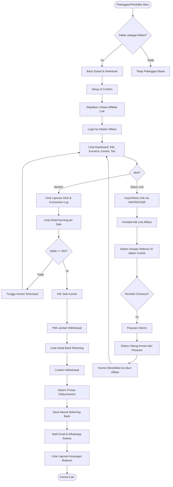
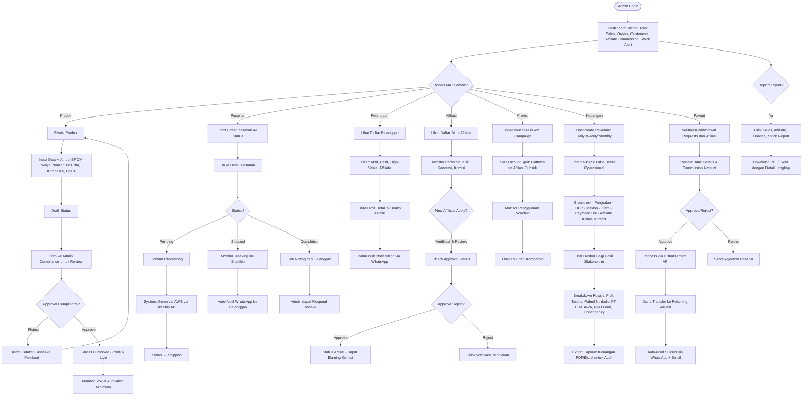
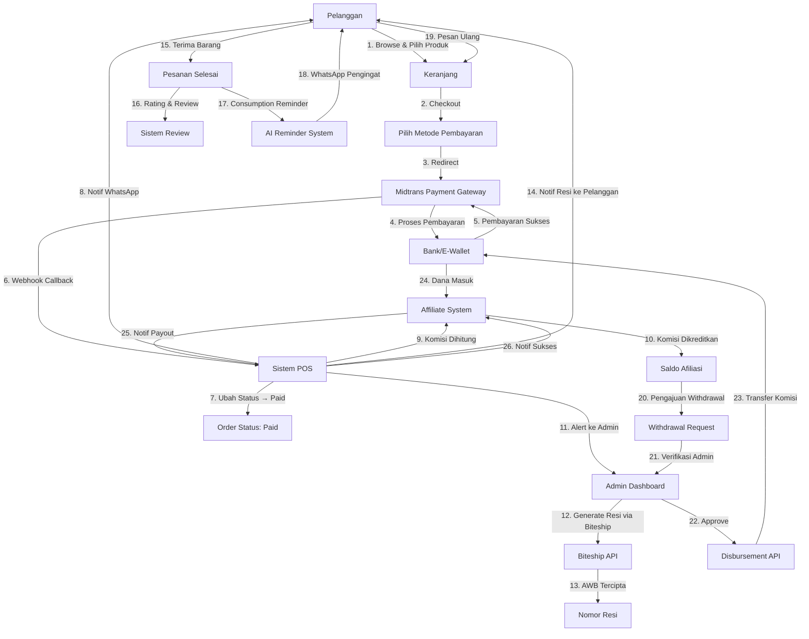

# 4. User Flow (Alur Pengguna)

Dokumen ini merinci alur interaksi pengguna dengan Platform e-Commerce PT PRABAVA Udaya Sejahtera, baik dalam bentuk narasi teks maupun representasi visual menggunakan diagram alir (Flowchart). Sistem ini dirancang untuk tiga entitas utama: **Pelanggan/Pasien**, **Mitra Afiliasi**, dan **Administrator**.

---

## 4.1. Alur Pengguna: Pelanggan/Pasien (Customer Journey)

### Deskripsi Teks: Registrasi & Profil

1. **Kunjungan Pertama Kali**: Pelanggan membuka halaman utama website tanpa login.
2. **Registrasi Akun**: Pelanggan mengklik tombol "Daftar" dan mengisi formulir registrasi dengan data:
   - Nama Lengkap
   - Email
   - Nomor WhatsApp (wajib - untuk notifikasi transaksi)
   - Password
3. **Konfirmasi Email & WhatsApp**: Sistem mengirimkan email verifikasi dan kode OTP ke WhatsApp pelanggan.
4. **Aktivasi Akun**: Pelanggan memasukkan kode OTP dan akun menjadi aktif.
5. **Profil Pelanggan**: Pelanggan dapat melengkapi profil dengan:
   - Tanggal Lahir
   - Jenis Kelamin
   - Alamat Utama (dengan *Dependent Dropdowns*: Provinsi → Kota/Kabupaten → Kecamatan)

### Deskripsi Teks: AI Chatbot & Konsultasi Awal

6. **AI Chatbot/Triage (Opsional)**: Sebelum browsing katalog, pelanggan dapat menggunakan fitur AI Chatbot untuk:
   - Menjawab pertanyaan dasar tentang produk
   - Memberikan rekomendasi awal berdasarkan kebutuhan kesehatan
   - Mengarahkan pelanggan ke produk yang tepat
   - Mempercepat customer service

### Deskripsi Teks: Browse & Konsultasi Produk

7. **Menjelajahi Katalog**: Pelanggan dapat browsing produk obat herbal berdasarkan kategori kesehatan (Penurunan Berat Badan, Antioksidan, dsb). Setiap halaman produk menampilkan:
   - Nomor Izin Edar BPOM (atribut khusus)
   - Komposisi & Dosis Anjuran
   - Deskripsi yang telah lolos persetujuan kepatuhan BPOM (tidak ada klaim berlebihan)
   - Ulasan & rating dari pelanggan lain

8. **Profil Kesehatan (Health Profile)**: Pelanggan dapat melengkapi profil kesehatan dasar dengan:
   - Riwayat kesehatan singkat
   - Alergi atau kondisi khusus
   - Tujuan kesehatan
   - Data ini digunakan untuk AI Recommendation yang lebih akurat

### Deskripsi Teks: Affiliasi (Opsional)

9. **Bergabung sebagai Mitra Afiliasi (Opsional)**: Di halaman profil, pelanggan dapat mengklik "Jadilah Mitra Afiliasi" untuk:
   - Mendapatkan tautan referral unik (*unique affiliate link*)
   - Memulai perjalanan afiliasi mereka
   - Menampilkan modal "Syarat & Ketentuan Afiliasi" dengan opsi setuju/tolak
   - Jika setuju, status berubah menjadi "Mitra Afiliasi Aktif" dan dapat membagikan link ke orang lain

### Deskripsi Teks: Keranjang & Checkout

10. **Penambahan Produk ke Keranjang**: Pelanggan memilih produk, menentukan jumlah, lalu klik "Tambah ke Keranjang".
11. **Tinjauan Keranjang**: Pelanggan dapat melihat daftar produk, mengubah kuantitas, atau menghapus item.
12. **Penerapan Voucher (Opsional)**: Pelanggan memasukkan kode voucher (jika ada) untuk diskon.
13. **Proceed to Checkout**: Pelanggan klik tombol "Lanjut ke Pembayaran".

### Deskripsi Teks: Alamat Pengiriman & Ongkos Kirim Dinamis

14. **Pilih/Edit Alamat Pengiriman**: Jika pelanggan memiliki beberapa alamat tersimpan, dapat memilih salah satu atau tambah baru.
15. **Form Alamat dengan Dependent Dropdowns** (Terintegrasi Biteship):
    - Pilih Provinsi (dropdown 1) → Data dari Biteship Area Database
    - Berdasarkan Provinsi, dropdown Kota/Kabupaten dimuat otomatis (dropdown 2)
    - Berdasarkan Kota/Kabupaten, dropdown Kecamatan dimuat otomatis (dropdown 3)
    - Input: Nama Jalan, Nomor Rumah, RT/RW, Kode Pos
    - **Catatan:** Sistem menyimpan Area ID dari Biteship untuk kalkulasi ongkos kirim yang presisi
16. **Kalkulasi Ongkos Kirim Dinamis**: Sistem memanggil REST API Biteship dengan:
    - Area ID dari Kecamatan yang dipilih
    - Total berat keranjang (dihitung dari produk)
    - Biteship mengembalikan daftar kurir dan tarif real-time: JNE, J&T, SiCepat, dsb
    - Sistem menampilkan harga ongkos kirim otomatis (live rate)
17. **Pilih Kurir & Layanan**: Pelanggan memilih kurir dan layanan pengiriman (Standar/Express) dengan ongkos yang terlihat jelas.
18. **Ringkasan Pesanan**: Sistem menampilkan:
    - Subtotal produk
    - Diskon (jika ada voucher)
    - Ongkos Kirim (dari Biteship live rate)
    - **Total Pembayaran (dalam IDR tanpa desimal)**

### Deskripsi Teks: Pembayaran via Midtrans

19. **Pemilihan Metode Pembayaran**: Pelanggan memilih metode pembayaran lokal (diintegrasikan Midtrans):
    - Virtual Account (BCA, Mandiri, BNI, BRI)
    - E-Wallet (GoPay, OVO, Dana)
    - QRIS
    - Transfer Bank Manual (opsional)
20. **Redirect ke Midtrans Snap**: Sistem mengarahkan ke antarmuka pembayaran Midtrans (Snap Payment Gateway).
21. **Pembayaran Selesai**: Pelanggan menyelesaikan pembayaran.
22. **Validasi Webhook Midtrans**: Sistem menerima callback/webhook dari Midtrans secara real-time dan secara otomatis:
    - Mengubah status pesanan menjadi "Paid" (Lunas)
    - Mengirimkan notifikasi WhatsApp ke pelanggan (via WhatsApp Gateway): "*Pembayaran Berhasil - Terima Kasih! Pesanan Anda sedang diproses.*"
    - Menghitung komisi afiliasi (jika pembelian melalui affiliate link)

### Deskripsi Teks: Notifikasi & Tracking

21. **Konfirmasi Pesanan**: Pelanggan menerima:
    - Email konfirmasi dengan detail pesanan
    - WhatsApp notification dengan ringkasan pesanan
22. **Pemrosesan Pesanan (Backend)**: Admin memproses pesanan, mengatur pengiriman, dan menghasilkan nomor resi (AWB).
23. **Notifikasi Resi**: Sistem mengirimkan WhatsApp notification ke pelanggan dengan:
    - Nomor Resi
    - Nama Kurir
    - Link Tracking (jika tersedia)
24. **Tracking Pesanan**: Pelanggan dapat melacak status pesanan di dasbor "Pesanan Saya" dengan pembaruan status real-time.
25. **Pesanan Tiba**: Setelah barang diterima, pelanggan dapat memberikan ulasan/rating produk.

### Deskripsi Teks: AI Consumption Reminder & Predictive Ordering

26. **Consumption Reminder (AI - Fitur Unggulan)**: Sistem secara otomatis menghitung jadwal konsumsi berdasarkan produk yang dibeli:
    - Contoh: Jika membeli 30 kapsul dengan dosis 1 kapsul/hari, pengingat akan dikirim setelah 30 hari
    - Sistem menggunakan *Jobs/Commands* Laravel untuk mengirim reminder terjadwal
    - Sistem mengirim WhatsApp via WhatsApp Gateway: "*Halo, ini waktunya mengonsumsi produk X Anda. Ingin memesan kembali? [Link Pesanan Cepat]*"
    - Fitur ini meningkatkan **kepatuhan pasien** dan **repeat purchase rate**

27. **Predictive Ordering (AI)**: Sistem menganalisis pola belanja pelanggan untuk memprediksi kapan mereka perlu membeli produk lagi (berdasarkan *machine learning*).

28. **Welcome Sequence & Journey Automation**: Pelanggan baru menerima serangkaian email/WhatsApp otomatis:
    - Selamat datang & tutorial penggunaan
    - Edukasi berkala tentang produk & kesehatan
    - Rekomendasi berdasarkan profil kesehatan mereka

29. **Pemesanan Ulang Cepat**: Pelanggan dapat dengan mudah memesan produk yang sama dengan mengklik link atau tombol "Pesan Lagi" di dasbor.

**Diagram Alir (Pelanggan - Pendekatan Modular):**

```mermaid
flowchart TD
    A([Pengunjung Baru]) --> B[Registrasi Akun]
    B --> C[Verifikasi Email & OTP WhatsApp]
    C --> C1{Lengkapi Profil Kesehatan?}
    C1 -->|Ya| C2[Input Health Profile: Riwayat, Alergi, Tujuan]
    C2 --> D{Afiliasi?}
    C1 -->|Tidak| D
    D -->|Ya| E[Setuju Syarat & Dapatkan Unique Affiliate Link]
    D -->|Tidak| F[Lanjut ke Browsing]
    E --> F
    F --> F1{Chat dengan AI Chatbot?}
    F1 -->|Ya| F2[AI Triage: Rekomendasi Awal]
    F2 --> G[Browse Katalog Produk dengan Atribut BPOM]
    F1 -->|Tidak| G
    G --> H[Pilih Produk & Qty]
    H --> I[Tambah ke Keranjang]
    I --> J{Lanjut Belanja?}
    J -->|Ya| G
    J -->|Tidak| K[Review Keranjang]
    K --> L{Ada Voucher?}
    L -->|Ya| M[Input Kode Voucher]
    L -->|Tidak| N[Lanjut ke Checkout]
    M --> N
    N --> O[Pilih/Edit Alamat Pengiriman]
    O --> P[Fill Form dengan Dependent Dropdowns: Provinsi → Kota → Kecamatan via Biteship DB]
    P --> Q[Sistem Kalkulasi Live Rate via Biteship API REST]
    Q --> R[Pilih Kurir & Layanan Pengiriman]
    R --> S[Lihat Ringkasan Total dalam IDR]
    S --> T[Pilih Metode Pembayaran Lokal via Midtrans]
    T --> U[Redirect ke Midtrans Snap Payment Gateway]
    U --> V[Proses Pembayaran di Midtrans]
    V --> W{Pembayaran Sukses?}
    W -->|Tidak| X[Tampil Error & Retry]
    X --> T
    W -->|Ya| Y[Webhook dari Midtrans: Status → Paid]
    Y --> Z[Hitung Komisi Afiliasi jika dari Affiliate Link]
    Z --> AA[Notif WhatsApp via WhatsApp Gateway: Pembayaran Berhasil]
    AA --> AB[Admin: Generate AWB via Biteship]
    AB --> AC[Notif WhatsApp: Nomor Resi & Link Tracking]
    AC --> AD[Pelanggan Track di Dashboard]
    AD --> AE[Barang Diterima]
    AE --> AE1{Kasih Rating?}
    AE1 -->|Ya| AE2[Submit Rating & Review]
    AE1 -->|Tidak| AF([Pesanan Selesai])
    AE2 --> AF
    AF --> AG[AI Consumption Reminder Job Terjadwal]
    AG -->|Sesuai Dosis/Qty| AH[WhatsApp: Pengingat Konsumsi & Link Pesan Ulang]
    AH --> AI{Pesan Ulang?}
    AI -->|Ya| J
    AI -->|Tidak| AJ([Tunggu Reminder Berikutnya])
```

---

## 4.2. Alur Pengguna: Mitra Afiliasi (Affiliate Partner)

### Deskripsi Teks: Pendaftaran & Setup Afiliasi

1. **Opsi Bergabung sebagai Afiliasi**: Mitra dapat bergabung melalui dua cara:
   - Dari halaman profil pelanggan yang sudah terdaftar (opsi "Jadilah Mitra Afiliasi")
   - Atau registrasi langsung sebagai Mitra Afiliasi baru dari halaman depan
2. **Persetujuan Syarat & Ketentuan**: Mitra mengklik tombol setuju untuk menerima persyaratan afiliasi, termasuk:
   - Tingkat komisi berdasarkan tier (Basic 10%, Premium 15%, Leader 15% + 5% Bonus Jaringan)
   - Kebijakan pembayaran (Minimum withdrawal: Rp 100.000)
   - Periode pembayaran komisi (Bulanan)
3. **Data Afiliasi**: Sistem membuat profil afiliasi dengan data:
   - Nama Afiliasi (dapat disesuaikan)
   - Email
   - Nomor WhatsApp
   - Nomor Rekening (opsional saat registrasi, dapat ditambahkan nanti)

### Deskripsi Teks: Dasbor Afiliasi & Link Referral

4. **Dasbor Afiliasi**: Mitra melihat ringkasan statistik:
   - Total Klik (*Click*) referral link mereka
   - Total Konversi Penjualan
   - Total Komisi yang Terkumpul (pending & paid)
   - Status Tier Afiliasi
5. **Generator Referral Link**: Sistem otomatis menghasilkan unique link untuk setiap mitra, contoh:
   - `www.prabava.com?ref=AFFILIATE_ID_12345`
   - Atau format pendek: `prabava.com/aff/john-doe`
6. **Sharing Tools**: Mitra dapat membagikan link via:
   - Copy-paste manual ke clipboard
   - Tombol share WhatsApp (link otomatis terbuka di WA)
   - Tombol share Facebook / Instagram (text pre-filled)
   - Generate QR Code dari link referral

### Deskripsi Teks: Tracking & Komisi (Anti-Fraud)

7. **Pelacakan Atribusi Presisi (Mechanism Anti-Fraud)**: Ketika ada pembeli yang mengklik affiliate link, sistem:
   - Menyimpan **persistent cookie** atau **session data** dengan ID afiliasi unik
   - Mencatat referrer ID di **database order** saat pembeli melakukan checkout
   - Memastikan komisi dikreditkan ke afiliasi yang benar **(tidak ada duplikasi atau manipulasi)**
   - Jika buyer melakukan multiple purchases, atribusi tetap ke afiliasi awal (first-touch attribution)

8. **Laporan Performa Transparans**: Mitra dapat melihat:
   - Riwayat Klik (*Click Log*) dengan tanggal, waktu, dan user agent
   - Riwayat Konversi (*Conversion Log*) dengan detail pesanan yang dikonversi
   - Earning Per Sale (kontribusi komisi per pesanan)
   - CTR (Click-Through Rate) dan Conversion Rate

9. **Perhitungan Komisi Otomatis (Real-Time)**: Setiap kali ada pesanan sukses dari referral link afiliasi:
   - Sistem menghitung komisi berdasarkan **tier dan total value pesanan**
   - Formula komisi: `(Nilai Pesanan) × (Persentase Komisi Tier)`
   - Komisi dikreditkan ke akun afiliasi secara **real-time** (tidak perlu approval manual)
   - Komisi tercatat dalam dashboard dengan status "Pending" → "Earned" → "Paid"

10. **Tier Upgrade Otomatis**: Berdasarkan total earning atau jumlah konversi dalam periode tertentu, afiliasi dapat naik tier:
    - **Basic (10%)**: Entry level untuk semua afiliasi baru
    - **Basic → Premium (15%)**: Saat earning kumulatif mencapai Rp 1.000.000 per bulan
    - **Premium → Leader (15% + 5% Bonus Tim)**: Saat earning mencapai Rp 5.000.000 per bulan
    - Leader juga mendapat **komisi dari subordinate network** (5% dari penjualan tim mereka)

### Deskripsi Teks: Withdrawal & Payout

11. **Registrasi Nomor Rekening**: Di dasbor "Pengaturan Pembayaran", Mitra dapat:
    - Memilih Bank (BCA, Mandiri, BNI, BRI, CIMB)
    - Memasukkan Nomor Rekening
    - Sistem melakukan Account Inquiry ke Payment Gateway untuk validasi
    - Menampilkan Nama Pemilik Rekening yang tervalidasi
    - Mitra mengkonfirmasi dan menyimpan
12. **Pengajuan Withdrawal**: Ketika saldo komisi mencapai minimum (Rp 100.000), Mitra dapat:
    - Klik tombol "Tarik Komisi"
    - Memilih jumlah yang ingin ditarik (dapat sebagian atau seluruhnya)
    - Sistem menampilkan perkiraan waktu pencairan (1-3 hari kerja)
    - Klik "Konfirmasi Withdrawal"
13. **Proses Payout**: Sistem (via Disbursement API) memproses transfer langsung ke rekening bank Mitra.
14. **Notifikasi Payout Sukses**: Mitra menerima email dan WhatsApp notification:
    - "*Penarikan Komisi Berhasil. Rp XXX.XXX telah ditransfer ke rekening Anda. Cek WhatsApp untuk detail.*"
15. **Laporan Keuangan**: Mitra dapat mengunduh laporan komisi bulanan dalam format PDF dengan detail:
    - Total Klik
    - Total Konversi
    - Total Earning
    - Total Withdrawal
    - Saldo Tersisa

**Diagram Alir (Mitra Afiliasi):**

---

## 4.3. Alur Pengguna: Administrator (PT PRABAVA)

### Deskripsi Teks: Login & Dashboard Utama

1. **Login Admin**: Administrator masuk dengan email dan password khusus dengan role "Admin" atau "Superadmin".
2. **Dasbor Utama**: Admin melihat ringkasan statistik real-time:
   - Total Penjualan Hari Ini
   - Total Pesanan (Pending, Processing, Completed)
   - Total Pelanggan Aktif
   - Total Komisi Afiliasi Terbayar
   - Performa Stok (Produk yang hampir habis)

### Deskripsi Teks: Manajemen Produk & Katalog

3. **Tambah/Edit Produk**: Admin dapat:
   - Upload foto produk
   - Isi data produk: Nama, Deskripsi, SKU
   - Atur harga (basis + diskon)
   - Tambahkan atribut khusus **wajib (untuk kepatuhan BPOM)**:
     - Nomor Izin Edar BPOM
     - Komposisi (ingredients)
     - Dosis Anjuran
     - Batasan penggunaan (kontraindikasi)
   - Set kategori kesehatan
   - Tentukan stok awal
   - Untuk produk bundel: Kelompokkan beberapa varian menjadi "Paket Hemat" dengan harga khusus

4. **Alur Persetujuan Konten (Kepatuhan BPOM)**: Konten produk dan deskripsi harus melalui workflow approval sebelum dipublikasikan:
   - Admin membuat draft produk → Status: "Draft"
   - Sistem mengirim notifikasi ke **Admin Compliance/Moderator** untuk review
   - Moderator memeriksa klaim produk (tidak boleh berlebihan/misleading)
   - Moderator dapat:
     - **Approve**: Produk tayang → Status: "Published"
     - **Reject with notes**: Kembali ke draft dengan catatan revisi
   - Tujuan: Mencegah pelanggaran regulasi BPOM tentang klaim obat herbal

5. **Manajemen Stok**: Admin dapat:
   - Melihat laporan stok real-time untuk setiap produk
   - Melakukan adjustmen stok (jika ada kesalahan input atau restock masuk)
   - Menerima alert otomatis saat stok mencapai batas minimum (misalnya: stok < 10 unit)
   - Fitur ini membantu menghindari overselling

### Deskripsi Teks: Manajemen Pesanan

6. **Daftar Pesanan**: Admin melihat daftar pesanan dengan status:
   - **Pending**: Menunggu konfirmasi
   - **Processing**: Sedang dikemas
   - **Shipped**: Sudah dikirim (dengan nomor resi)
   - **Completed**: Selesai
   - **Canceled**: Dibatalkan
7. **Detail Pesanan**: Admin dapat membuka detail pesanan:
   - Informasi pelanggan
   - Daftar produk yang dipesan
   - Alamat pengiriman lengkap
   - Metode pembayaran
   - Status pembayaran
   - Note/Catatan khusus
8. **Pengaturan Pengiriman**: Admin dapat:
   - Konfirmasi pesanan (ubah status ke "Processing")
   - Generate nomor resi otomatis via Biteship API
   - Print label pengiriman
   - Update tracking number secara manual (jika perlu)
   - Sistem otomatis mengirimkan notifikasi WhatsApp ke pelanggan dengan nomor resi
9. **Penanganan Pesanan Bermasalah**:
   - Admin dapat membatalkan pesanan jika ada kendala
   - Sistem mengirim notifikasi pembatalan ke pelanggan via WhatsApp
   - Admin dapat menambahkan catatan alasan pembatalan

### Deskripsi Teks: Manajemen Pelanggan & Afiliasi

10. **Data Pelanggan**: Admin dapat:
    - Melihat daftar semua pelanggan
    - Cari pelanggan berdasarkan nama, email, atau nomor WhatsApp
    - Lihat profil lengkap: Alamat, riwayat pembelian, tier loyalitas
    - Kirim bulk notification via WhatsApp ke segmen pelanggan tertentu
11. **Manajemen Afiliasi**: Admin dapat:
    - Melihat daftar semua mitra afiliasi
    - Lihat performa masing-masing afiliasi (total klik, konversi, komisi)
    - Verifikasi identitas mitra afiliasi baru
    - Set tier afiliasi secara manual (jika diperlukan)
    - Block/Suspend afiliasi jika ada pelanggaran
    - Kirim pesan komunikasi kepada afiliasi via internal chat atau WhatsApp

### Deskripsi Teks: Manajemen Promosi & Voucher

12. **Buat Kampanye Diskon**: Admin dapat membuat:
    - Kode voucher dengan jumlah terbatas atau waktu terbatas
    - Diskon otomatis untuk pembelian minimum tertentu
    - Flash sale dengan periode waktu spesifik
    - Set pembagian beban diskon antara platform dan afiliasi (Discount Split)
13. **Monitoring Kampanye**: Admin dapat:
    - Lihat laporan penggunaan voucher
    - Lihat ROI dari setiap kampanye
    - Pause/Resume kampanye jika diperlukan

### Deskripsi Teks: Dasbor Keuangan & Profit Sharing (Transparansi Pemangku Kepentingan)

14. **Laporan Penjualan**: Admin dapat:
    - Lihat total revenue harian/mingguan/bulanan
    - Breakdown penjualan per produk
    - Breakdown penjualan per source (direct purchase, affiliate, kampanye/promo)
    - Export laporan dalam format PDF/Excel untuk keperluan audit

15. **Kalkulator Laba Bersih Operasional (Real-Time)**: Sistem secara otomatis menampilkan kalkulasi untuk setiap transaksi/periode:
    - **Total Penjualan Kotor**: Jumlah penjualan sebelum dikurangi apapun
    - **Dikurangi: HPP (Cost of Goods)**: Biaya harga pokok penjualan
    - **Dikurangi: Biaya Maklon**: Biaya pemroduksian/packaging
    - **Dikurangi: Ongkos Kirim Subsidized**: Jika ada subsidi ongkos kirim dari perusahaan
    - **Dikurangi: Biaya Payment Gateway**: Komisi Midtrans (fee persen dari transaksi)
    - **Dikurangi: Komisi Afiliasi**: Total komisi yang dibayar ke mitra afiliasi
    - **Dikurangi: Diskon/Voucher**: Beban subsidi promo
    - **= Laba Bersih Operasional**

16. **Dasbor Transparansi Bagi Hasil (Profit Sharing Dashboard)**: Admin/Superadmin dapat melihat laporan pembagian laba yang **transparan dan terverifikasi**:
    - **Total Laba Bersih Operasional** (dari kalkulasi di atas)
    - **Pembagian Laba** berdasarkan **struktur stakeholder**:
      - **Royalti Pemegang Paten (Prof. Taruna)**: X% dari laba bersih
      - **Royalti Pengembang Formulasi (Fahrul Nurkolis)**: Y% dari laba bersih
      - **PT PRABAVA Udaya Sejahtera (Operasional & Manajemen)**: Z% dari laba bersih
      - **Dana Pengembangan (R&D & Inovasi)**: W% dari laba bersih
      - **Cadangan Risiko/Kontingensi**: V% dari laba bersih
    - **Laporan dapat di-export sebagai PDF** untuk audit internal dan pertanggungjawaban kepada semua stakeholder
    - **Transparansi penuh**: Setiap stakeholder dapat melihat laporan pembagian mereka secara berkala (bulanan/kuartalan)

### Deskripsi Teks: Payout Management

17. **Verifikasi Pencairan Afiliasi**: Admin dapat:
    - Melihat daftar permintaan withdrawal dari mitra afiliasi
    - Verifikasi nomor rekening (jika diperlukan)
    - Approve/Reject pengajuan withdrawal
    - Process payout secara bulk
18. **Force Payout (Emergency)**: Superadmin dapat:
    - Memicu pencairan komisi secara paksa untuk afiliasi tertentu (dalam situasi darurat)
    - Mengirim notifikasi ke afiliasi setelah payout selesai

### Deskripsi Teks: Internal Communication

19. **Internal Chat**: Admin dapat:
    - Menerima pesan dari mitra afiliasi atau pelanggan yang meminta bantuan
    - Membalas pesan dengan cepat
    - Assign pesan ke admin lain jika diperlukan
    - Close ticket setelah masalah terselesaikan

### Deskripsi Teks: Laporan & Analytics

20. **Export Laporan**: Admin dapat mengunduh laporan dalam berbagai format:
    - Laporan Penjualan (PDF, Excel)
    - Laporan Afiliasi (PDF, Excel)
    - Laporan Keuangan & Profit Sharing (PDF, Excel)
    - Laporan Stok (PDF, Excel)

**Diagram Alir (Administrator):**

---

## 4.4. Alur Transaksi End-to-End (High-Level Overview)

Diagram berikut menunjukkan alur transaksi secara keseluruhan dari perspektif sistem:

---

## Kesimpulan & Catatan Arsitektur

Alur pengguna di atas dirancang untuk memberikan pengalaman yang mulus (*seamless*) bagi ketiga entitas utama:

- **Pelanggan**: Registrasi mudah, AI chatbot untuk konsultasi awal, checkout yang intuitif dengan pembayaran lokal, dan pengingat konsumsi otomatis untuk meningkatkan kepatuhan & repeat purchase.
- **Mitra Afiliasi**: Tracking performa yang transparan dengan mekanisme anti-fraud, komisi otomatis real-time, dan withdrawal yang mudah.
- **Administrator**: Manajemen lengkap produk dengan approval workflow kepatuhan BPOM, pesanan, keuangan (profit sharing), dan afiliasi dari satu dasbor terpusat.

### Catatan Teknis & Architectural Approach

Sesuai dengan **analisis_bagisto.md**, sistem ini **TIDAK dibangun dari nol**, melainkan menggunakan **Bagisto** (framework e-commerce open-source berbasis Laravel + Vue.js) sebagai **core engine** dengan pendekatan **Modular/Package Development**:

#### Fitur Sistem Bawaan Bagisto (Minimal Configuration):
- ✅ Manajemen Katalog & Produk (dengan atribut custom untuk BPOM)
- ✅ Keranjang Belanja & Checkout (akan di-intercept untuk payment integration)
- ✅ Manajemen Pesanan (Order Management)
- ✅ Manajemen Pelanggan & CRM Dasar
- ✅ Lokalisasi (mata uang IDR, bahasa Indonesia)
- ✅ Sistem Promosi (Discount/Voucher)

#### Fitur Custom Packages (Harus Dibangun Khusus):
1. **Modul Integrasi Midtrans (Payment Gateway)**
   - Intercept checkout flow bawaan
   - Integrasi Midtrans Snap/Core API
   - Webhook untuk real-time payment validation
   
2. **Modul Integrasi Biteship (Logistics & Shipping)**
   - Dependent dropdowns untuk alamat (Provinsi → Kota → Kecamatan)
   - Live rate calculation dari Biteship API
   - Auto AWB generation
   
3. **Modul Notifikasi WhatsApp (Event-Based)**
   - Observer pada event transaksi
   - Integration dengan WhatsApp Gateway API
   - Real-time notification untuk order updates
   
4. **Modul Sistem Afiliasi Berjenjang** ⭐
   - Generator unique affiliate link
   - Tracking atribusi dengan anti-fraud mechanism
   - Komisi otomatis dengan tier system (Basic/Premium/Leader)
   - Dasbor afiliasi dengan analytics
   
5. **Modul Keuangan & Profit Sharing** ⭐
   - Kalkulator laba bersih operasional (real-time)
   - Dasbor transparansi bagi hasil dengan breakdown stakeholder
   - Laporan keuangan otomatis
   
6. **Modul AI & Personalisasi** ⭐
   - Consumption Reminder (Jobs/Commands Laravel)
   - Predictive ordering (Machine Learning integration)
   - Journey Automation (Welcome sequence, edukasi berkala)
   
7. **Modul Approval Workflow (Compliance BPOM)**
   - Custom approval state untuk produk & konten
   - Admin Compliance review untuk verifikasi klaim

#### Benefit Pendekatan Ini:
- **Upgrade-Safe**: Inti Bagisto tetap bersih, mudah di-update versi
- **Scalable**: Modul custom bisa dikembangkan/dimodifikasi independent
- **Developer-Friendly**: Tim dapat menggunakan DevDocs Bagisto untuk menambah fitur baru
- **Faster Time-to-Market**: Tidak perlu membangun from scratch (~70% fitur e-commerce sudah tersedia)

---

Setiap alur terintegrasi dengan sistem pembayaran Midtrans, logistik Biteship, notifikasi WhatsApp, dan perhitungan keuangan yang otomatis untuk memastikan efisiensi operasional dan kepuasan pelanggan maksimal, sambil tetap menjaga kepatuhan regulasi BPOM untuk industri obat herbal Indonesia.
