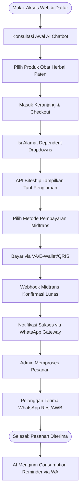
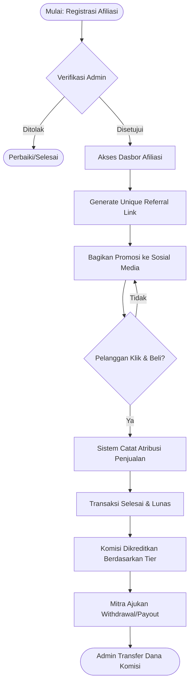
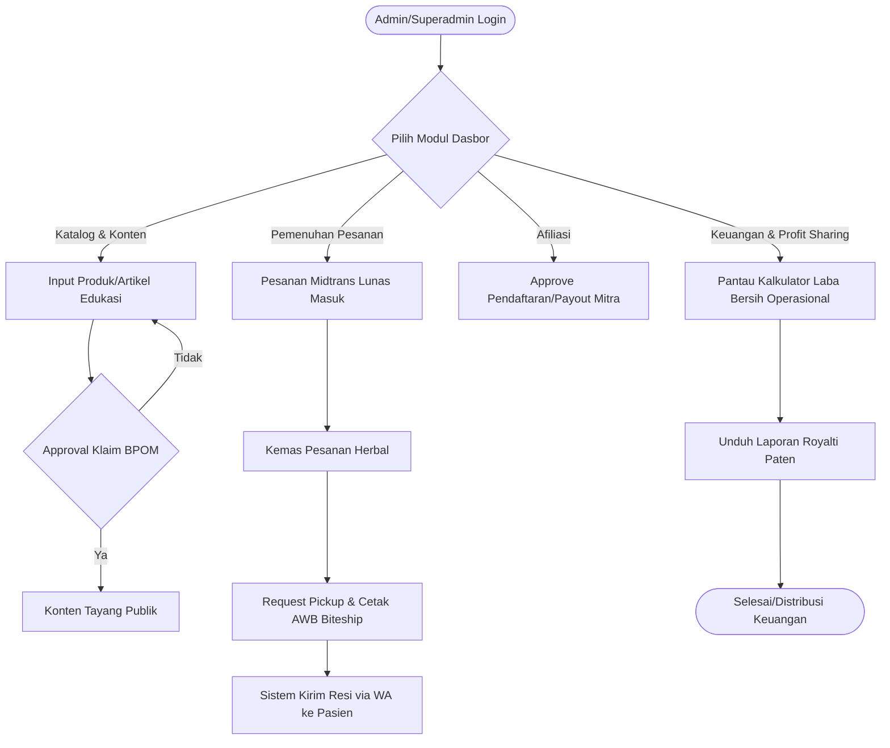

# 4. User Flow (Alur Pengguna)

Dokumen ini merinci alur interaksi pengguna dengan Sistem *Digital Health Commerce* PT PRABAVA Udaya Sejahtera. Terdapat 3 (tiga) entitas pengguna utama: **Pelanggan/Pasien**, **Mitra Afiliasi**, dan **Administrator (PT PRABAVA)**.

---

## 4.1. Alur Pengguna: Pelanggan / Pasien

**Deskripsi Teks:**
1. **Kunjungan Awal & Edukasi (Triage):** Pelanggan mengunjungi website, disambut oleh *Welcome Sequence* atau *AI Chatbot* yang memberikan edukasi dasar dan mengarahkan ke produk herbal yang relevan.
2. **Registrasi:** Pelanggan mendaftar akun dengan menautkan nomor WhatsApp aktif (esensial untuk pengiriman notifikasi dan *reminder*).
3. **Pemesanan (*Add to Cart*):** Pelanggan memilih produk herbal berbasis paten dan memasukkannya ke dalam keranjang belanja.
4. **Checkout (Alamat Terstruktur):** Pelanggan masuk ke halaman *checkout*. Pelanggan diwajibkan mengisi formulir alamat menggunakan sistem ***dependent dropdowns* berjenjang (Provinsi -> Kota/Kabupaten -> Kecamatan)** yang disinkronisasi langsung dengan ID Area Biteship.
5. **Kalkulasi Logistik (Biteship):** Setelah alamat dipilih, sistem memanggil API Biteship secara dinamis untuk menampilkan daftar kurir lokal beserta harga pengiriman yang riil (*live rate*).
6. **Pembayaran (Midtrans):** Pelanggan memilih saluran pembayaran lokal via gerbang Midtrans (opsi: Virtual Account, E-Wallet, atau QRIS).
7. **Validasi & Notifikasi WhatsApp:** Pelanggan melakukan pembayaran. *Webhook* Midtrans menginformasikan sistem bahwa tagihan lunas. Sistem (*Observer*) secara instan mengirimkan konfirmasi pembayaran ke WhatsApp pelanggan.
8. **Pengiriman:** Setelah Admin memproses pengemasan, nomor resi (AWB) akan dikirimkan otomatis ke WhatsApp pelanggan.
9. **Retensi Berbasis AI:** Selama masa pengobatan, AI akan mengirimkan *Consumption Reminder* harian ke WhatsApp pelanggan. Menjelang obat habis, AI akan mengirimkan pesan tawaran pembelian ulang (*Predictive Ordering*).

**Diagram Alir (Pelanggan/Pasien):**

---

## 4.2. Alur Pengguna: Mitra Afiliasi

**Deskripsi Teks:**
1. **Registrasi Afiliasi:** Pengguna mendaftar secara khusus sebagai Mitra Afiliasi. Akun ditangguhkan hingga diverifikasi dan disetujui oleh Administrator.
2. **Dasbor & Generator Referral:** Setelah disetujui, Mitra Afiliasi otomatis masuk di level *Tier Basic*. Mitra dapat membuat tautan produk unik (*unique link*) atau kode promo khusus langsung dari dasbor mereka.
3. **Pemasaran (Promosi):** Mitra membagikan tautan tersebut melalui media sosial atau jaringan pribadi mereka.
4. **Pelacakan Atribusi:** Ketika Pelanggan mengeklik tautan tersebut dan melakukan transaksi yang berhasil (Lunas & Selesai), *Tracking System* secara otomatis mencatat asal usul penjualan (*anti-fraud*).
5. **Kredit Komisi Berjenjang:** Sistem menghitung komisi berdasarkan level tier Mitra (Basic, Premium, atau Leader). Komisi langsung dikreditkan ke saldo (Dompet Mitra).
6. **Pengajuan Pencairan (Payout):** Mitra Afiliasi mendaftarkan rekening bank pribadi (divalidasi menggunakan *Account Inquiry API*). Mitra mengajukan penarikan dana (*withdrawal*). Admin memverifikasi dan mengirimkan dana komisi ke rekening Mitra.
7. **Eskalasi Level (Naik Tier):** Jika akumulasi penjualan mencapai target tertentu, sistem otomatis menaikkan tingkat Mitra menjadi Premium atau Leader.

**Diagram Alir (Mitra Afiliasi):**

---

## 4.3. Alur Pengguna: Administrator (PT PRABAVA)

**Deskripsi Teks:**
1. **Manajemen Konten & Kepatuhan BPOM:** Admin memasukkan produk baru atau artikel edukasi kesehatan. Konten akan masuk ke *draft* (alur *approval* khusus) untuk diperiksa kesesuaian klaim medisnya terhadap regulasi BPOM. Jika lolos moderasi, konten diterbitkan.
2. **Manajemen Afiliasi:** Menyetujui pendaftaran Mitra Afiliasi baru dan mengeksekusi (*approve*) permintaan pencairan komisi (*payout*) yang diajukan oleh Mitra.
3. **Pemenuhan Pesanan (Order Fulfillment):** 
   - Admin memantau dasbor *Order* untuk melihat pesanan yang sudah *Paid*.
   - Admin mengatur pengemasan barang.
   - Admin mengeklik tombol *Shipment/Request Pickup* yang terintegrasi dengan API Biteship untuk mencetak label pengiriman (nomor resi/AWB) secara otomatis.
   - Sistem secara *background* mengirim resi ke WhatsApp Pelanggan.
4. **Pemantauan Dasbor Keuangan (Profit Sharing):** Admin dan Superadmin mengakses *Profit Sharing Dashboard* yang menyajikan kalkulasi laba bersih secara otomatis (Nilai Jual Kotor - HPP - Maklon - Logistik - Midtrans Fee - Komisi Afiliasi).
5. **Pelaporan Royalti Pemangku Kepentingan:** Sistem menghasilkan laporan yang menunjukkan persentase margin keuntungan murni dan jumlah loyalti paten yang harus didistribusikan kepada para pemangku kepentingan.

**Diagram Alir (Administrator & Superadmin):**

