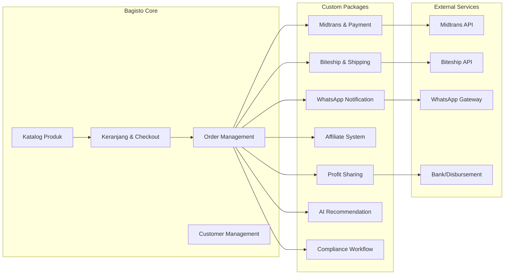

# 5. Architecture (Arsitektur Sistem)

Dokumen ini menjelaskan arsitektur teknis platform e-commerce PT PRABAVA Udaya Sejahtera. Fokus utama adalah penggunaan **Bagisto sebagai core engine** dan rancangan fitur-fitur baru menggunakan pendekatan **Modular / Package Development** agar sistem tetap **upgrade-safe**.

---

## 5.1. Prinsip Arsitektur Utama

1. **Bagisto sebagai Fondasi**
   - Platform e-commerce ini dibangun di atas **Bagisto** (Laravel + Vue.js).
   - Bagisto menjadi `core engine` untuk kebutuhan e-commerce dasar seperti katalog produk, keranjang, checkout, manajemen pesanan, dan manajemen pelanggan.

2. **Modular / Package Development**
   - Fitur spesifik PT PRABAVA dikembangkan sebagai **Package Laravel / Extension Bagisto** yang independen.
   - Setiap paket baru diisolasi sehingga core Bagisto tetap tidak dimodifikasi secara langsung.
   - Ini memungkinkan sistem mudah di-upgrade ketika versi Bagisto baru tersedia.

3. **Upgrade-Safe**
   - Inti sistem (Bagisto core) dibiarkan utuh.
   - Kustomisasi dan logika bisnis kompleks diletakkan di dalam paket terpisah.
   - Struktur folder dan dependency disusun agar patch/upgrade Bagisto tidak merusak fitur kustom.

4. **Integrasi API & Event-Driven**
   - Sistem menggunakan API eksternal untuk pembayaran, logistik, notifikasi, dan verifikasi bank.
   - Pengiriman notifikasi dan sinkronisasi status dilakukan secara event-driven melalui listener dan observer.

---

## 5.2. Platform Core: Bagisto

### 5.2.1. Komponen Utama Bagisto

- **Backend:** Laravel
- **Frontend:** Vue.js (dengan Blade pada area admin dan beberapa halaman toko)
- **Database:** MySQL / MariaDB
- **Queue:** Redis atau database queue untuk jobs asinkron
- **Cache:** Redis atau file cache
- **File Storage:** Local / S3 (optional)

### 5.2.2. Fitur Bawaan yang Digunakan

- Manajemen katalog produk (Product Management)
- Manajemen kategori dan atribut produk
- Keranjang belanja & checkout flow dasar
- Order Management & invoice
- Customer Management
- Rule engine promosi dan diskon
- Lokalisasi bahasa dan mata uang

### 5.2.3. Customization Strategy

- Semua fitur bisnis baru dibangun sebagai package Laravel/Bagisto.
- Core Bagisto hanya digunakan sebagai mekanisme dasar, sedangkan kode bisnis kustom ditempatkan di folder `packages/` dan `custom/`.
- Contoh package:
  - `Package/MidtransPayment`
  - `Package/BiteshipShipping`
  - `Package/WhatsAppNotification`
  - `Package/AffiliateSystem`
  - `Package/ProfitSharing`
  - `Package/AIRecommendation`
  - `Package/ComplianceWorkflow`

---

## 5.3. Modular Package Development

### 5.3.1. Bagisto Core vs Package

| Lapisan | Tanggung Jawab |
|---|---|
| Core Bagisto | Katalog, keranjang, checkout dasar, customer, order, shipping generic |
| Paket Kustom | Fitur bisnis khusus, integrasi lokal, compliance, afiliasi, AI, notifikasi |

### 5.3.2. Paket Kustom yang Dibutuhkan

1. **Midtrans Payment Package**
   - Intercept checkout Bagisto
   - Redirect ke Midtrans Snap
   - Tangani callback webhook
   - Perbarui status order secara otomatis

2. **Biteship Shipping Package**
   - Implementasi dependent dropdown alamat: Provinsi → Kota/Kabupaten → Kecamatan
   - Direktori Area ID Biteship
   - Kalkulasi ongkos kirim live rate
   - Generate AWB otomatis

3. **WhatsApp Notification Package**
   - Observer pada event order/pembayaran/pengiriman
   - Kirim notifikasi transaksi ke WhatsApp pelanggan
   - Kirim notifikasi pembayaran, resi, dan reminder

4. **Affiliate System Package**
   - Generate unique referral link/kode
   - Lacak atribusi penjualan secara presisi
   - Hitung komisi berjenjang
   - Kelola dashboard affiliate

5. **Profit Sharing Package**
   - Hitung laba bersih operasional pada setiap transaksi
   - Breakdown distribusi ke stakeholder
   - Sediakan dashboard laporan finansial

6. **AI Recommendation & Automation Package**
   - AI chatbot untuk triage dan rekomendasi awal
   - Consumption reminder via background job
   - Predictive ordering dan journey automation

7. **Compliance Workflow Package**
   - Approval flow untuk produk dan konten edukasi
   - Verifikasi kepatuhan BPOM sebelum publish

---

## 5.4. Arsitektur Data dan Alur Integrasi

### 5.4.1. Alur Data Utama

1. **Frontend toko** mengirim request checkout ke Bagisto core.
2. **Bagisto core** menyimpan order sementara.
3. **Midtrans package** mengambil order dan membuat transaksi pembayaran.
4. **Midtrans** mengembalikan callback webhook ke sistem.
5. **Order status** diperbarui menjadi `Paid`.
6. **WhatsApp package** mengirim notifikasi kepada pelanggan.
7. **Biteship package** mengkalkulasi ongkos kirim dan membuat AWB.
8. **Affiliate package** menghitung komisi jika order berasal dari referral.
9. **Profit sharing package** menghitung distribusi profit untuk laporan.

### 5.4.2. Event-Driven Integrasi

- `OrderPlaced` → trigger notifikasi WhatsApp, cek stok, buat shipment
- `PaymentConfirmed` → set status order, kirim notifikasi, hitung komisi afiliasi
- `ShipmentCreated` → generate AWB, kirim tracking ke customer
- `ProductApprovalRequested` → trigger approval workflow

---

## 5.5. Keamanan & Kepatuhan

### 5.5.1. Keamanan Data

- Gunakan HTTPS untuk semua endpoint.
- Enkripsi data sensitif di database sesuai kebutuhan.
- Batasi akses admin dengan role-based permissions Bagisto.

### 5.5.2. Kepatuhan BPOM

- Semua konten produk, klaim manfaat, serta materi edukasi harus melalui **approval workflow**.
- Metadata produk harus menyertakan informasi BPOM secara terstruktur.
- Sistem harus menyimpan audit trail untuk review konten dan keputusan compliance.

---

## 5.6. Deployment dan Operasional

### 5.6.1. Infrastruktur Rekomendasi

- Web server: Nginx atau Apache
- PHP 8.x
- Database: MySQL/MariaDB
- Cache/Queue: Redis
- Storage: Local + object storage untuk media
- Monitoring: Laravel Telescope / Sentry / Prometheus

### 5.6.2. Environment Configuration

- `APP_ENV`, `APP_DEBUG`, `APP_URL`
- `DB_*`
- `MIDTRANS_` credentials
- `BITESHIP_` credentials
- `WHATSAPP_` gateway credentials
- `QUEUE_CONNECTION=redis`

### 5.6.3. Upgrade-Safe Deployment

- Update Bagisto core dengan patch terpisah dari package kustom.
- Jalankan regression test pada package kustom setelah upgrade core.
- Dokumentasikan setiap override dan event listener kustom.

---

## 5.7. Diagram Arsitektur

---

## 5.8. Catatan Penting

- Pendekatan ini memastikan sistem dapat terus berkembang tanpa mengunci tim pengembang pada satu versi Bagisto.
- Setiap fitur kustom harus didokumentasikan sebagai package mandiri.
- Testing dan integrasi otomatis penting untuk menjaga stabilitas ketika core Bagisto diupgrade.
