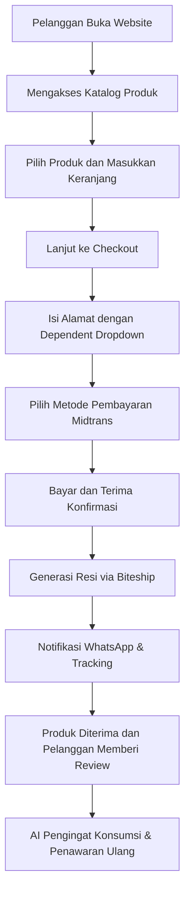

# Model 1: Website Toko Online Obat Herbal (Tanpa Konsultasi)

## Tujuan
Menjelaskan model bisnis aplikasi yang berfokus pada penjualan obat herbal berbasis 10 paten melalui website resmi. Model ini tidak melibatkan konsultasi dokter; pelanggan membeli langsung produk yang sudah terdaftar BPOM.

## Ringkasan Singkat
Model ini adalah **toko online produk herbal** yang dijalankan oleh PT PRABAVA Udaya Sejahtera sebagai kanal resmi. Fokusnya adalah menjaga:
- **Paten dan formulasi ilmiah** sebagai pembeda produk
- **Legalitas BPOM** untuk keamanan dan klaim yang sah
- **Produksi maklon** agar produk terstandar
- **Pemasaran digital berbasis website AI** untuk edukasi, rekomendasi, dan retensi
- **Kontrol penuh** terhadap harga dan pelanggan tanpa marketplace umum

## Inti Framework Model
1. **Penjualan Produk**: Produk herbal ditampilkan sebagai katalog resmi.
2. **Checkout Lokal**: Pembayaran via Midtrans (VA, GoPay, OVO, QRIS).
3. **Logistik**: Pengiriman diatur melalui Biteship menggunakan alamat berjenjang (Provinsi → Kota → Kecamatan).
4. **Notifikasi**: Transaksi dan resi dikirim otomatis lewat WhatsApp Gateway.
5. **Affiliate**: Mitra penjualan dapat membagikan link referral, dan komisi dihitung otomatis.
6. **AI Marketing**: Website memberi rekomendasi produk, pengingat konsumsi, dan email/WhatsApp otomatis.

## Apa yang Dibutuhkan
- Halaman produk dan katalog
- Sistem checkout e-commerce sederhana
- Integrasi Midtrans dan Biteship
- Modul notifikasi WhatsApp
- Dasbor affiliate dan payout
- Konten BPOM & approval workflow
- Data pelanggan (CRM) untuk retensi

## Alur Sederhana

## Penjelasan untuk Non-Teknologi
Website ini bekerja seperti toko online biasa, tapi dengan tambahan utama:
- Produk sudah dibuat dari **paten khusus**, bukan sekadar jamu biasa.
- Setiap produk **legal dan terdaftar BPOM**.
- Tidak ada konsultasi dokter di dalam aplikasi; pelanggan langsung membeli dan menerima produk.
- Sistem akan otomatis menghitung biaya kirim, memproses pembayaran lokal, dan memberi tahu pelanggan lewat WhatsApp.
- Mitra penjualan mendapatkan komisi melalui **link referral** yang terhubung langsung ke website.

## Estimasi Waktu Pembuatan
- **Durasi: 5–6 bulan** (dengan 1 pengembang utama)
- Breakdown:
  - 1 bulan analisis, desain bisnis, dan perencanaan teknis
  - 1,5 bulan pengembangan katalog produk, checkout, dan integrasi pembayaran
  - 1,5 bulan integrasi logistik, notifikasi WhatsApp, dan dashboard affiliate
  - 1 bulan pengujian, penyempurnaan BPOM compliance, dan peluncuran awal

> Estimasi ini mempertimbangkan pengerjaan oleh satu orang dengan skala proyek MVP untuk website toko online.

## Kelebihan Model Ini
- Lebih cepat diluncurkan dibanding model telemedicine
- Biaya pengembangan lebih rendah
- Fokus pada penjualan dan pemasaran produk
- Risiko regulasi lebih sederhana karena tidak ada layanan medis

## Keterbatasan Model Ini
- Tidak dapat melayani produk yang memerlukan resep atau konsultasi medis
- Tidak cocok untuk layanan obat keras atau program terapi klinis
- Penggunaan data kesehatan lebih terbatas
