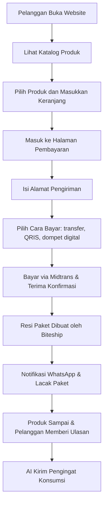

# Model 1: Website Toko Online Obat Herbal (Tanpa Konsultasi)

## Tujuan
Menjelaskan model bisnis aplikasi yang berfokus pada penjualan obat herbal berbasis 10 paten melalui website resmi. Model ini tidak melibatkan konsultasi dokter; pelanggan membeli langsung produk yang sudah terdaftar BPOM.

## Ringkasan Singkat
Model ini adalah **toko online resmi untuk produk herbal** yang dioperasikan oleh PT PRABAVA Udaya Sejahtera sebagai kanal resmi. Fokusnya adalah menjaga:
- **Paten dan formulasi ilmiah** sebagai pembeda produk
- **Legalitas BPOM** untuk keamanan dan klaim yang sah
- **Produksi maklon** agar produk terstandar
- **Pemasaran digital berbasis website AI** untuk edukasi, rekomendasi, dan retensi
- **Kontrol penuh** terhadap harga dan pelanggan tanpa marketplace umum

> Catatan: **BPOM** adalah lembaga usaha obat dan makanan di Indonesia yang menyetujui produk agar bisa dipasarkan.
> **Paten/formulasi ilmiah** di sini berarti resep produk dibuat dengan standar khusus dan bukan sembarang ramuan.

## Inti Framework Model
1. **Penjualan Produk**: Produk herbal ditampilkan dalam katalog online yang mudah dilihat.
2. **Pembayaran di Website**: Pelanggan bisa bayar langsung dari website menggunakan Midtrans. Midtrans adalah layanan pihak ketiga yang memproses pembayaran, seperti transfer bank atau dompet digital.
3. **Pengiriman Barang**: Pengiriman diatur melalui Biteship. Biteship adalah layanan kurir yang membantu mencetak resi dan melacak paket.
4. **Pemberitahuan Otomatis**: Setelah pembayaran atau paket dikirim, pelanggan mendapat pesan otomatis lewat WhatsApp.
5. **Program Affiliate**: Mitra penjualan bisa berbagi link khusus. Saat pelanggan membeli lewat link ini, mitra dapat komisi secara otomatis.
6. **AI Marketing untuk Rekomendasi dan Pengingat**: Website memberi rekomendasi produk dan bisa mengirim pengingat minum produk lewat email atau WhatsApp.

## Apa yang Dibutuhkan
- Halaman produk dan katalog yang mudah dibaca
- Sistem pembayaran online sederhana yang terhubung dengan Midtrans
- Sistem pengiriman yang terhubung dengan Biteship untuk mencetak resi dan melacak paket
- Fitur notifikasi otomatis lewat WhatsApp
- Dasbor untuk mitra affiliate dan sistem pembayaran komisi
- Dokumen BPOM dan alur persetujuan produk
- Data pelanggan untuk menyimpan riwayat pembelian dan membantu mempertahankan pelanggan

## Alur Sederhana

## Penjelasan Non-Teknis
Website ini bekerja seperti toko online biasa, dengan beberapa tambahan penting:
- Produk dibuat dari **resep khusus** yang membuatnya berbeda dari obat herbal biasa.
- Semua produk **terdaftar BPOM**, artinya sudah diperiksa dan aman untuk dijual.
- Tidak ada konsultasi dokter di dalam aplikasi. Pelanggan tinggal memilih produk, membayar, dan menunggu kiriman.
- Sistem menghitung biaya kirim, memproses pembayaran otomatis, dan memberi tahu pelanggan lewat WhatsApp.
- Mitra penjualan bisa menggunakan **link referral**. Artinya, jika orang membeli lewat link khusus mereka, mitra mendapat komisi otomatis.

> Catatan istilah:
> - **Midtrans**: layanan pembayaran online yang digunakan untuk menerima uang dari pelanggan.
> - **Biteship**: layanan pengiriman paket yang membantu membuat nomor resi dan melacak barang.
> - **Link referral**: tautan khusus yang melacak siapa yang membawa pelanggan baru ke website.

## Estimasi Waktu Pembuatan
- **Durasi: 5–6 bulan** (dengan 1 pengembang utama)
- Breakdown:
  - 1 bulan analisis, desain bisnis, dan perencanaan teknis
  - 1,5 bulan pengembangan katalog produk, checkout, dan integrasi pembayaran
  - 1,5 bulan integrasi logistik, notifikasi WhatsApp, dan dashboard affiliate
- 1 bulan pengujian, penyempurnaan kepatuhan BPOM, dan peluncuran awal

> Estimasi ini mempertimbangkan pengerjaan oleh satu orang dengan skala versi awal untuk website toko online.

## Kelebihan Model Ini
- Lebih cepat diluncurkan dibanding model telemedicine
- Biaya pengembangan lebih rendah
- Fokus pada penjualan dan pemasaran produk
- Risiko regulasi lebih sederhana karena tidak ada layanan medis

## Keterbatasan Model Ini
- Tidak dapat melayani produk yang memerlukan resep atau konsultasi medis
- Tidak cocok untuk layanan obat keras atau program terapi klinis
- Penggunaan data kesehatan lebih terbatas
