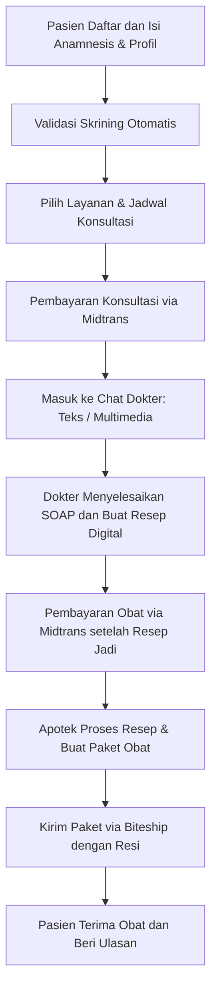

# Model 2: Aplikasi Telemedicine dengan Konsultasi dan Resep Obat

## Tujuan
Menjelaskan model bisnis aplikasi telemedicine yang melibatkan konsultasi dokter, pembuatan resep digital, dan pengiriman obat keras. Model ini cocok untuk layanan kesehatan berbasis program pengobatan seperti penurunan berat badan.

## Ringkasan Singkat
Model ini adalah **platform telemedicine** lengkap, bukan hanya toko online. Platform menggabungkan:
- **Pendaftaran pasien dengan skrining klinis**
- **Katalog layanan dan penemuan layanan** dengan pencarian dan filter paket medis
- **Profil pasien, manajemen alamat, dan portal pengguna** yang terintegrasi
- **Konsultasi dokter multimedia** (chat + opsi video)
- **Rekam medis elektronik** dengan formulir SOAP
- **Resep digital (e-prescription)** yang aman
- **Pembayaran dua tahap via Midtrans** (konsultasi + obat)
- **Manajemen apotek & logistik via Biteship** untuk pengiriman obat
- **Ulasan, rating, dan kebijakan retur/refund** sebagai bagian pengalaman pasien
- **Kepatuhan PSE dan regulasi kesehatan**

## Inti Framework Model
1. **Sistem Pasien**: Pasien mendaftar dengan WhatsApp, mengisi anamnesis, dan mengelola profil serta alamat pengiriman.
2. **Sistem Dokter**: Dokter diverifikasi oleh admin, membuat jadwal, menerima konsultasi, dan mengelola resep.
3. **Katalog Layanan & Booking**: Pasien mencari layanan berdasarkan kondisi, memilih paket, dan memilih jadwal konsultasi.
4. **Konsultasi**: Chat multimedia terintegrasi di browser; opsi video bila diperlukan.
5. **Resep Digital**: Dokter membuat resep PDF, dilindungi watermark atau QR code.
6. **Apotek & Fulfillment**: Apotek memproses resep, mengemas obat sesuai aturan, dan menyiapkan pengiriman.
7. **Pembayaran Midtrans**: Sistem memproses pembayaran konsultasi dan obat melalui Midtrans.
8. **Logistik Biteship**: Pengiriman obat terotomasi dengan pembuatan resi Biteship dan pelacakan.
9. **Ulasan & Refund**: Pasien dapat memberi rating/komentar dan mengajukan klaim retur jika perlu.
10. **Notifikasi**: WhatsApp dan internal chat memberi update otomatis.

## Apa yang Dibutuhkan
- Akun pasien, dokter, apotek, admin
- Modul profil pengguna, manajemen alamat, dan pengaturan notifikasi
- Katalog layanan telemedicine dengan halaman detail, pencarian, dan filter
- Formulir anamnesis dan skrining otomatis
- Sistem chat medis dengan multimedia
- Modul resep digital dan manajemen farmasi
- Integrasi dengan Midtrans sebagai payment gateway
- Integrasi dengan Biteship untuk logistik, resi, dan tracking
- Sistem ulasan/rating dan kebijakan retur/refund
- Fitur compliance PSE dan dokumen audit

## Alur Sederhana

## Penjelasan Non-Teknis
Model ini mirip dengan layanan klinik digital. Pasien tidak perlu pergi ke rumah sakit atau install banyak aplikasi. Semua proses dilakukan melalui website yang terintegrasi dengan Midtrans dan Biteship:
- Pasien mendaftar, mengisi profil dan alamat, serta menjawab pertanyaan medis sederhana.
- Pasien mencari paket layanan, melihat detail layanan, lalu memilih dokter dan jadwal konsultasi.
- Pembayaran konsultasi dan obat dilakukan melalui Midtrans, sehingga status tagihan terbarui otomatis.
- Konsultasi dilakukan lewat chat, dan jika perlu, via video langsung dalam browser.
- Dokter membuat resep, obat dikirim ke alamat pasien melalui Biteship, dan pasien dapat melacak nomor resi.
- Pasien dapat memberi ulasan setelah layanan selesai, serta mengajukan klaim retur/refund jika diperlukan.
- Semua tahap pembayaran dan logistik dikontrol oleh sistem sehingga pasien mengikuti aturan dan apotek dapat memproses resep dengan benar.

## Estimasi Waktu Pembuatan
- **Durasi: 8–9 bulan** (dengan 1 pengembang utama)
- Breakdown:
  - 1 bulan analisis regulasi, arsitektur, dan rencana kepatuhan
  - 2 bulan pengembangan fitur pasien, dokter, dan chat multimedia
  - 1,5 bulan pengembangan resep digital, SOAP, dan manajemen apotek
  - 1,5 bulan integrasi pembayaran, logistik, notifikasi, dan compliance PSE
  - 1 bulan uji coba akhir, validasi medis, dan peluncuran awal

> Estimasi ini mempertimbangkan tingkat kompleksitas telemedicine dan beban kerja satu orang pengembang.

## Kelebihan Model Ini
- Bisa melayani produk yang memerlukan resep dan pemantauan medis
- Memberikan nilai tambah layanan kesehatan digital
- Tepat untuk program pengobatan tertentu, seperti penurunan berat badan
- Lebih kuat dalam hal kepercayaan jika dikaitkan dengan dokter dan farmasi

## Keterbatasan Model Ini
- Pengembangan lebih lama dan lebih kompleks
- Butuh proses verifikasi dokter/apotek dan kepatuhan regulasi lebih ketat
- Biaya operasional lebih tinggi karena melibatkan tenaga medis dan pengelolaan resep
