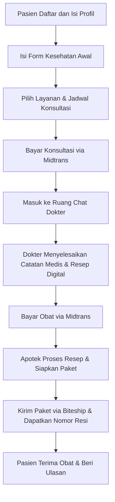

# Model 2: Aplikasi Telemedicine dengan Konsultasi dan Resep Obat

## Tujuan
Menjelaskan model bisnis aplikasi telemedicine yang melibatkan konsultasi dokter, pembuatan resep digital, dan pengiriman obat keras. Model ini cocok untuk layanan kesehatan berbasis program pengobatan seperti penurunan berat badan.

## Ringkasan Singkat
Model ini adalah **platform telemedicine/ kesehatan online** yang lengkap, bukan hanya toko obat. Platform ini menyediakan:
- **Pendaftaran pasien dengan skrining klinis/pemeriksaan awal sederhana**.
- **Katalog layanan dengan fitur pencarian dan filter**, jadi pasien bisa pilih paket yang cocok.
- **Profil pasien dan alamat pengiriman** yang disimpan agar proses lebih cepat.
- **Konsultasi dokter via chat dan video** jika dibutuhkan.
- **Rekam medis elektronik** yang dibuat dokter dengan struktur SOAP yang rapi.
- **Resep digital** yang bisa dicetak atau dibuka sebagai PDF.
- **Pembayaran dua tahap lewat Midtrans** untuk konsultasi dan obat.
- **Manajemen apotek & logistik via Biteship** untuk pengiriman obat
- **Ulasan dan kebijakan pengembalian uang** untuk pengalaman pasien yang lebih aman.
- **Kepatuhan PSE dan aturan kesehatan** untuk menjaga legalitas dan keamanan.

## Inti Framework Model
1. **Sistem Pasien**: Pasien mendaftar dengan WhatsApp, mengisi anamnesis, lalu menyimpan profil dan alamat pengiriman.
2. **Sistem Dokter**: Dokter diverifikasi oleh admin, membuat jadwal, memberikan konsultasi, dan menulis resep.
3. **Katalog Layanan & Booking**: Pasien mencari layanan berdasarkan kebutuhan, memilih paket, dan memesan jadwal konsultasi.
4. **Konsultasi**: Konsultasi dilakukan lewat chat, dengan opsi video bila dibutuhkan.
5. **Rekam Medis Elektronik**: Dokter membuat catatan medis yang terstruktur agar riwayat pasien tersimpan rapi.
6. **Resep Digital**: Dokter membuat resep dalam bentuk digital, yang bisa diunduh sebagai PDF, dilindungi watermark atau QR code.
7. **Apotek & Fulfillment**: Apotek memproses resep, mengemas obat sesuai aturan, dan menyiapkan pengiriman.
8. **Pembayaran Midtrans**: Pembayaran konsultasi dan obat dilakukan lewat Midtrans, layanan pembayaran online.
9. **Pengiriman via Biteship**: Obat dikirim lewat Biteship, layanan logistik yang juga membantu melacak paket.
10. **Ulasan & Refund**: Pasien bisa memberi nilai dan komentar, serta mengajukan pengembalian jika ada masalah.
11. **Notifikasi**: Sistem mengirim pesan otomatis lewat WhatsApp untuk update penting.

## Apa yang Dibutuhkan
- Akun pasien, dokter, apotek, dan admin
- Halaman profil pengguna dan pengaturan alamat
- Katalog layanan dengan rincian paket, pencarian, dan filter
- Formulir isian kesehatan awal yang sederhana
- Sistem chat yang bisa mengirim teks, suara, dan gambar
- Modul resep digital yang aman dan bisa dicetak
- Integrasi pembayaran lewat Midtrans (layanan pembayaran online)
- Integrasi logistik lewat Biteship untuk nomor resi dan pelacakan
- Fitur ulasan/rating dan aturan pengembalian uang
- Fitur keamanan dan audit untuk kepatuhan PSE dan peraturan kesehatan

## Alur Sederhana

## Penjelasan Non-Teknis
Model ini seperti klinik online. Pasien bisa mendapat layanan kesehatan tanpa keluar rumah atau install aplikasi lain. Seluruh proses ada di website, dengan bantuan Midtrans dan Biteship.
- Pasien mendaftar, mengisi profil, alamat, dan menjawab pertanyaan kesehatan dasar.
- Pasien memilih paket layanan yang paling sesuai, lalu memilih dokter dan jadwal.
- Pembayaran konsultasi dan obat dilakukan lewat Midtrans, layanan pembayaran online. Setelah bayar, statusnya langsung berubah di sistem.
- Konsultasi dilakukan lewat chat, dan jika perlu, bisa ditambah video.
- Dokter menulis catatan kesehatan dan resep digital. Resep digital artinya resep dibuat dalam bentuk file elektronik.
- Setelah resep dibuat, apotek memproses pesanan dan paket dikirim lewat Biteship. Pasien mendapat nomor resi untuk melacak paket.
- Setelah paket sampai, pasien bisa memberi nilai dan komentar. Kalau ada masalah, pasien bisa mengajukan pengembalian uang atau retur.

> Catatan istilah:
> - **Midtrans**: layanan pembayaran yang membantu pelanggan membayar dengan transfer bank, QRIS, atau dompet digital.
> - **Biteship**: layanan pengiriman paket yang membantu cetak resi dan melacak paket.
> - **Resep digital**: resep yang dibuat dalam bentuk elektronik, sehingga bisa disimpan atau dicetak.
> - **Formulir kesehatan awal**: daftar pertanyaan sederhana untuk membantu dokter mengetahui kondisi pasien sebelum konsultasi.

## Estimasi Waktu Pembuatan
- **Durasi: 8–9 bulan** (dengan 1 pengembang utama)
- Breakdown:
  - 1 bulan analisis regulasi, arsitektur, dan rencana kepatuhan
  - 2 bulan pengembangan fitur pasien, dokter, dan chat multimedia
  - 1,5 bulan pengembangan resep digital, rekam medis SOAP, dan manajemen apotek
  - 1,5 bulan integrasi pembayaran, logistik, notifikasi, dan kepatuhan aturan PSE
  - 1 bulan uji coba akhir, validasi medis, dan peluncuran awal

> Estimasi ini mempertimbangkan tingkat kompleksitas telemedicine dan beban kerja satu orang pengembang.

## Kelebihan Model Ini
- Bisa melayani produk yang memerlukan resep dan pemantauan medis
- Memberikan nilai tambah layanan kesehatan digital
- Tepat untuk program pengobatan tertentu, seperti penurunan berat badan
- Lebih kuat dalam hal kepercayaan jika dikaitkan dengan dokter dan farmasi

## Keterbatasan Model Ini
- Pengembangan lebih lama dan lebih kompleks
- Butuh proses verifikasi dokter/apotek dan kepatuhan regulasi lebih ketat
- Biaya operasional lebih tinggi karena melibatkan tenaga medis dan pengelolaan resep
