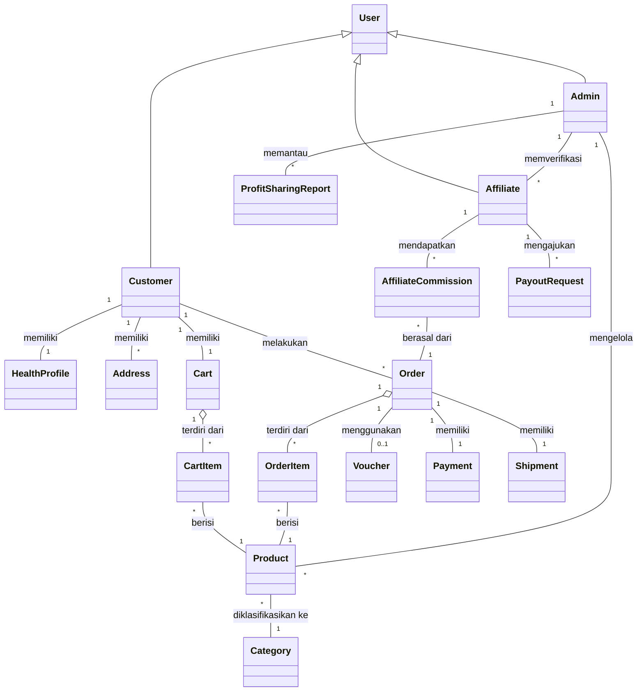

# 8. Domain Model

Dokumen ini mendefinisikan **Domain Model** (model konseptual) dari Sistem *Digital Health Commerce* PT PRABAVA Udaya Sejahtera. Sesuai dengan kerangka kerja *ICONIX Process*, Domain Model berfungsi sebagai "kamus proyek" visual yang bertujuan untuk:
1. Menyepakati entitas (objek dunia nyata) yang terlibat di dalam sistem.
2. Memetakan relasi dasar antar-entitas (Generalisasi, Agregasi, dan Asosiasi).
3. Menghindari ambiguitas istilah sebelum kita menuliskan deskripsi *Use Case*.

> [!NOTE]
> Pada fase ini, diagram hanya menampilkan **Nama Objek** tanpa atribut (variabel) atau metode (fungsi). Penambahan atribut dan metode akan dilakukan nanti pada pembuatan *Class Diagram* di fase Desain Detail.

---

## 8.1. Visualisasi Domain Model

Diagram di bawah ini menggunakan sintaks `mermaid.js` untuk menggambarkan struktur logis objek-objek utama di dalam bisnis toko obat herbal dan telemedicine.

---

## 8.2. Kamus Proyek (Deskripsi Entitas)

Berikut adalah daftar definisi singkat untuk setiap objek yang digambarkan pada diagram di atas:

### Aktor (Pengguna Sistem)
- **User**: Konsep umum dari pengguna sistem (entitas abstrak).
- **Customer** (*Pelanggan/Pasien*): Pengguna yang membeli produk obat herbal, mengisi riwayat kesehatan, dan menjadi subjek dari fitur *AI Consumption Reminder*.
- **Affiliate** (*Mitra Afiliasi*): Pengguna yang mempromosikan produk melalui tautan referal (*unique link*) untuk mendapatkan komisi. Memiliki tingkatan/tier (Basic, Premium, Leader).
- **Admin**: Staf internal PT PRABAVA Udaya Sejahtera (mencakup Superadmin dan tim *Compliance/Moderator* yang memvalidasi klaim obat herbal).

### E-Commerce & Transaksi
- **Product** (*Produk*): Obat herbal berbasis paten yang dijual di platform. Mengandung data penting seperti Izin Edar BPOM, dosis, dan komposisi.
- **Category** (*Kategori*): Pengelompokan produk berdasarkan kondisi medis atau manfaat kesehatan (contoh: Penurunan Berat Badan, Antioksidan).
- **Cart** (*Keranjang*): Tempat penyimpanan sementara produk yang ingin dibeli pelanggan.
- **CartItem**: Entitas tunggal produk di dalam keranjang beserta kuantitasnya.
- **Order** (*Pesanan*): Catatan permanen dari transaksi pembelian yang dilakukan pelanggan.
- **OrderItem**: Rincian individual dari suatu pesanan yang mengikat harga beli pada saat transaksi.
- **Voucher**: Kupon diskon promo yang diterapkan pelanggan saat *checkout*.

### Integrasi Eksternal (Payment & Logistik)
- **Payment** (*Pembayaran*): Catatan transaksi finansial yang diproses dan divalidasi statusnya melalui *webhook* **Midtrans**.
- **Shipment** (*Pengiriman*): Data pengiriman fisik paket (termasuk Nomor Resi/AWB dan *live rate*) yang dikalkulasi melalui integrasi API **Biteship**.
- **Address** (*Alamat*): Informasi tujuan pengiriman yang wajib menggunakan sistem terstruktur *dependent dropdown* (Provinsi -> Kota -> Kecamatan).

### Fitur Kustom Utama (Core Features)
- **HealthProfile** (*Profil Kesehatan*): Data medis dasar pelanggan (alergi, tujuan kesehatan, riwayat singkat) yang digunakan untuk *AI Triage* dan algoritma *Predictive Ordering*.
- **AffiliateCommission** (*Komisi Afiliasi*): Nilai pembagian keuntungan yang dikreditkan ke dompet Mitra Afiliasi setiap kali terjadi transaksi sukses dari tautan referalnya.
- **PayoutRequest** (*Penarikan Dana*): Pengajuan penarikan (*withdrawal*) saldo komisi oleh Mitra Afiliasi ke rekening bank pribadi.
- **ProfitSharingReport** (*Laporan Laba Bersih*): Dasbor transparansi yang menghitung pembagian royalti (untuk pemegang paten, peneliti, dan PT PRABAVA) setelah dikurangi HPP, biaya logistik, dan komisi.

---
*Dengan disepakatinya entitas-entitas dan kamus proyek ini, tahap selanjutnya adalah merancang **Use Case Diagram** dan mendeskripsikan skenario penggunaan.*
