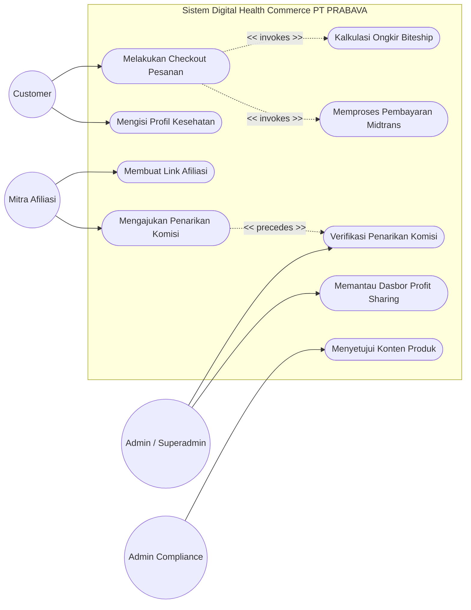

# 9. Use Case Model

Dokumen ini merupakan bagian dari tahap **Pendefinisian Kebutuhan (Requirements)** pada metodologi *ICONIX Process*. Dokumen ini memuat **Use Case Diagram** yang merepresentasikan batasan fungsionalitas sistem, serta **Skenario Use Case** yang merinci langkah demi langkah interaksi antara Aktor dan Sistem. Skenario ini akan digunakan sebagai dasar untuk pembuatan *Robustness Diagram* pada tahap selanjutnya.

---

## 9.1. Use Case Diagram

Diagram di bawah ini memvisualisasikan fungsionalitas sistem dan interaksinya dengan aktor utama. 
*Catatan: Sesuai panduan ICONIX, dependensi menggunakan relasi `invokes` (memanggil sub-fungsi) dan `precedes` (mendahului/urutan).*

---

## 9.2. Skenario Use Case (Use Case Descriptions)

Berikut adalah pendeskripsian skenario teks untuk fungsi-fungsi inti sistem. Penulisan menggunakan format *Basic Course* (skenario normal/sukses) dan *Alternate Courses* (skenario pengecualian/gagal).

### UC-01: Melakukan Checkout Pesanan
**Aktor Utama**: Customer (Pelanggan)
**Tujuan**: Menyelesaikan pembelian produk di dalam keranjang, memilih kurir pengiriman, dan membayar pesanan.

**Basic Course (Skenario Normal)**:
1. Customer mengklik tombol "Lanjut ke Pembayaran" pada halaman Keranjang.
2. Sistem menampilkan halaman *Checkout* yang berisi form Alamat Pengiriman dan ringkasan pesanan.
3. Customer memilih Provinsi dari *dropdown* pertama.
4. Sistem mengambil data Kota/Kabupaten terkait dan menampilkannya di *dropdown* kedua.
5. Customer memilih Kota/Kabupaten, lalu sistem memuat Kecamatan di *dropdown* ketiga.
6. Customer melengkapi detail alamat dan mengklik "Simpan Alamat".
7. Sistem meng-*invoke* **Kalkulasi Ongkir Biteship** dengan mengirim total berat dan ID Area Kecamatan.
8. Sistem menampilkan daftar layanan kurir beserta tarif (*live rate*).
9. Customer memilih kurir dan metode pembayaran yang diinginkan.
10. Customer mengklik "Bayar Sekarang".
11. Sistem meng-*invoke* **Memproses Pembayaran Midtrans**, mengubah status pesanan menjadi "Pending", dan mengarahkan Customer ke halaman pembayaran Snap Midtrans.

**Alternate Courses (Skenario Alternatif)**:
- **7a. API Biteship Gagal Merespons**: Sistem menampilkan pesan error "Layanan logistik sedang gangguan" dan meminta Customer mencoba beberapa saat lagi. Customer tidak dapat melanjutkan pembayaran.
- **11a. Metode Pembayaran Ditolak**: Sistem dari Midtrans menolak metode pembayaran, Customer diarahkan kembali ke halaman checkout dengan peringatan "Pembayaran ditolak, silakan pilih metode lain."

---

### UC-02: Mengajukan Penarikan Komisi (Withdrawal)
**Aktor Utama**: Mitra Afiliasi
**Tujuan**: Menarik saldo komisi afiliasi yang sudah terkumpul ke rekening bank pribadi.

**Basic Course (Skenario Normal)**:
1. Mitra Afiliasi membuka halaman "Dasbor Afiliasi".
2. Sistem menampilkan total klik, konversi, dan saldo komisi saat ini.
3. Mitra Afiliasi mengklik tombol "Tarik Komisi".
4. Sistem memvalidasi apakah saldo melebihi batas minimum penarikan (Rp 100.000).
5. Sistem menampilkan form penarikan (nominal dan pilihan rekening bank yang sudah tersimpan).
6. Mitra Afiliasi memasukkan nominal penarikan dan mengklik "Ajukan Penarikan".
7. Sistem menyimpan permohonan penarikan dengan status "Pending Verification".
8. Sistem mengirim notifikasi kepada Admin bahwa ada pengajuan *withdrawal* baru (memicu use case *precedes* **Verifikasi Penarikan Komisi**).

**Alternate Courses (Skenario Alternatif)**:
- **4a. Saldo Tidak Mencukupi**: Sistem menampilkan peringatan "Saldo Anda belum mencapai batas minimum penarikan Rp 100.000." Tombol pengajuan dinonaktifkan.
- **5a. Rekening Bank Belum Diatur**: Sistem mengarahkan Mitra Afiliasi ke halaman Pengaturan Profil untuk menambahkan nomor rekening bank terlebih dahulu sebelum bisa menarik komisi.

---

### UC-03: Menyetujui Konten Produk Obat (Approval Flow BPOM)
**Aktor Utama**: Admin Compliance (Moderator)
**Tujuan**: Memverifikasi deskripsi dan klaim khasiat dari produk obat herbal baru sebelum dipublikasikan ke publik, guna mematuhi regulasi BPOM.

**Basic Course (Skenario Normal)**:
1. Admin Compliance masuk ke halaman "Daftar Produk Menunggu Persetujuan".
2. Sistem menampilkan daftar draf produk yang baru dibuat oleh Admin Staf.
3. Admin Compliance memilih salah satu draf produk untuk di-*review*.
4. Sistem menampilkan detail produk (Nama, Nomor Izin Edar BPOM, Komposisi, Dosis, dan Deskripsi Khasiat).
5. Admin Compliance membaca deskripsi dan menilai tidak ada klaim *misleading*.
6. Admin Compliance mengklik tombol "Approve (Setujui)".
7. Sistem mengubah status produk dari "Draft" menjadi "Published" (Live).
8. Sistem menampilkan pesan sukses "Produk berhasil dipublikasikan."

**Alternate Courses (Skenario Alternatif)**:
- **5a. Klaim Produk Berlebihan (Melanggar Aturan)**: Admin Compliance menemukan deskripsi yang mengandung *overclaim*.
  1. Admin Compliance mengklik tombol "Reject (Tolak)".
  2. Sistem menampilkan kotak teks untuk catatan revisi.
  3. Admin Compliance menuliskan "Tolong hapus kata 'menyembuhkan 100%'" lalu klik "Kirim Penolakan".
  4. Sistem mengubah status kembali menjadi "Draft/Revisi" dan mengirim notifikasi revisi kepada pembuat produk (Admin Staf).
