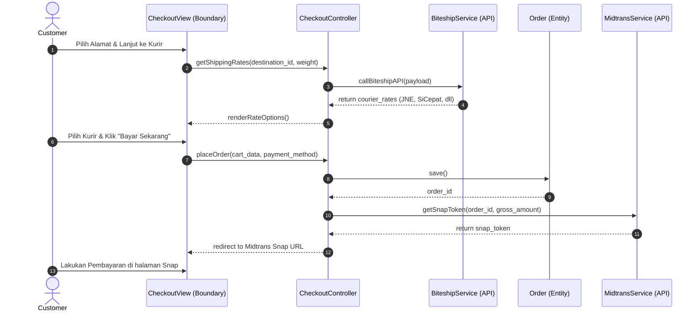
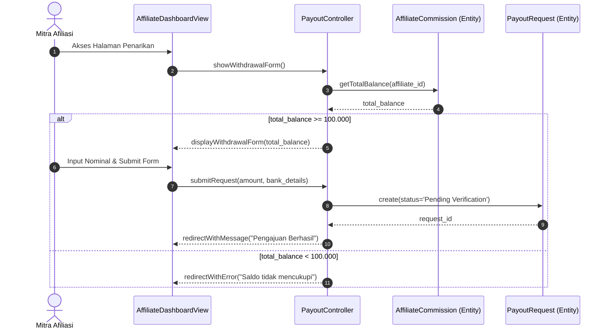
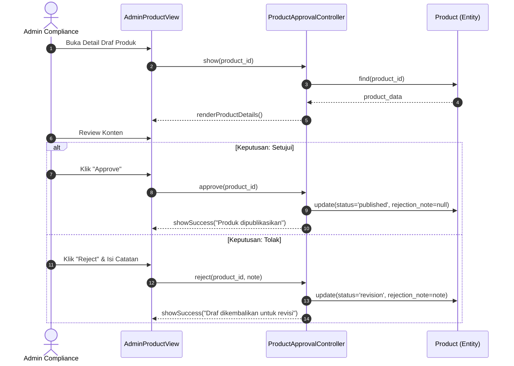

# 11. Sequence Diagram (Detailed Design)

Dokumen ini memuat **Sequence Diagram** yang merupakan bagian dari tahap *Desain Detail* pada metodologi ICONIX Process. Diagram ini menerjemahkan interaksi konseptual dari *Robustness Diagram* menjadi spesifikasi teknis yang mengalokasikan fungsi (perilaku) ke objek-objek spesifik. 

Mengingat sistem ini akan dibangun di atas ekosistem **Bagisto (Laravel + Vue.js)**, diagram ini memodelkan objek *Controller* sebagai *Laravel Controller/Service* dan *Entity* sebagai *Eloquent Model*, lengkap dengan pemanggilan API pihak ketiga.

---

## 11.1. UC-01: Melakukan Checkout Pesanan

Diagram ini mendetailkan proses perhitungan ongkos kirim dinamis melalui API Biteship dan pengalihan (redirect) ke *payment gateway* Midtrans.

---

## 11.2. UC-02: Mengajukan Penarikan Komisi (Withdrawal)

Diagram ini mengilustrasikan logika validasi batas minimum penarikan (*Minimum Payout*) dan pembuatan rekam (*record*) pengajuan.

---

## 11.3. UC-03: Menyetujui Konten Produk Obat (BPOM)

Diagram ini menjabarkan *Approval Flow* dengan penanganan skenario alternatif (Penolakan produk karena *overclaim*).

---
**Pembaruan Domain Model yang Teridentifikasi (Discovery):**
Dari pembedahan di atas, kita mengidentifikasi atribut dan metode baru yang harus ditambahkan ke rancangan Class Diagram di tahap berikutnya:
- Entitas `Order`: Fungsi `save()`
- Entitas `AffiliateCommission`: Fungsi `getTotalBalance()`
- Entitas `PayoutRequest`: Fungsi `create()`, dan atribut `status`
- Entitas `Product`: Atribut `status` (berisi *published*, *draft*, *revision*) dan `rejection_note`. Fungsi `update()`.
