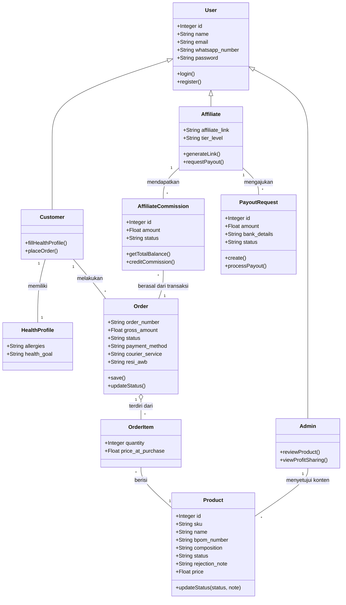

# 12. Class Diagram (Detailed Design)

Dokumen ini merupakan hasil akhir dari fase Desain Detail pada kerangka kerja **ICONIX Process**. **Class Diagram** di bawah ini adalah wujud evolusi dan finalisasi dari *Domain Model* (Dokumen 08) yang telah diperbarui dengan temuan-temuan atribut dan metode/fungsi dari tahap dekomposisi *Sequence Diagram* (Dokumen 11).

Diagram ini akan menjadi panduan teknis langsung (blueprint) bagi *programmer* dalam menyusun struktur kode sumber, terutama untuk file entitas model (`Model` pada kerangka kerja Eloquent Laravel/Bagisto).

---

## 12.1. Visualisasi Class Diagram

---

## 12.2. Pembaruan dan Penjelasan Atribut/Metode

Perubahan signifikan pada diagram kelas teknis ini (berdasarkan *discovery* pada tahap sebelumnya) adalah:

1. **Entitas `Product`**
   - Menambahkan atribut khusus BPOM: `bpom_number`, `composition`.
   - Menambahkan kendali status publikasi: `status` (berisi *draft*, *published*, atau *revision*) dan `rejection_note` untuk alur *compliance*.
   - Menambahkan metode `updateStatus()` yang dipanggil oleh *ProductApprovalController*.

2. **Entitas `Order` & `OrderItem`**
   - Menambahkan struktur data logistik seperti `courier_service` dan `resi_awb`.
   - Menambahkan metode operasional standar `save()`.

3. **Sistem Afiliasi (`AffiliateCommission` & `PayoutRequest`)**
   - Menambahkan fungsi pembacaan rekapitulasi `getTotalBalance()` yang dibuktikan esensial pada proses penarikan saldo.
   - Menambahkan atribut rekam mutasi `bank_details` dan `status` pengajuan pada PayoutRequest.

### 12.3. Kesimpulan ICONIX Process

Dengan selesainya dokumen **Class Diagram** ini, seluruh 4 tonggak (Milestone) dari proses ICONIX telah terpenuhi:
1. **Requirements** (Domain Model & Use Case).
2. **Preliminary Design** (Robustness Diagram mengurai ambiguitas).
3. **Detailed Design** (Sequence Diagram membagi fungsi).
4. **Final Model** (Class Diagram yang siap dikodekan).

Spesifikasi dalam dokumen-dokumen pemodelan UML ini sudah matang dan siap diserahkan kepada tim *Developer* untuk mulai tahap Implementasi Kode (*Coding & Unit Testing*) pada ekosistem Laravel/Bagisto.
